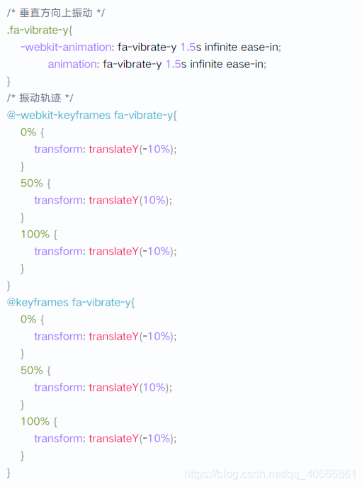

# Postcss

> 在研究学习tailwind的过程中，我了解到了postcss，它可以通过各种loader，配置 weebpack配置项，然后操作js来生成css

postcss基于 Node.js 。这是一个 CSS 处理工具，在使用的时候还需要搭配其他的插件来配合。我们先使用 npm 把这个插件安装上，这里我们直接使用命令行工具来安装这个插件，所以安装的插件名称应该是“postcss-cli”。

```bash
npm i postcss-cli@6.1.3 -D
```

这条命令里 -D 的含义是把这个包的版本信息记录在 package.json 里的 devDependencies 字段里，表示这是在开发过程会使用到的插件。

这样这个插件就装好了，我们可以用下面的命令来测试一下：

```bash
npx postcss src/my-ui.css -o dist/my-ui.css
```

这条命令的含义就是使用 npx 调用了 postcss-cli 提供的 postcss 命令，后面跟着的就是一些参数。这条命令实际的格式是：

```bash
npx postcss '要处理的CSS文件位置' -o '生成目标文件的位置'
```

执行完这一条命令后，就会在根目录下生成一个 dist 目录，里面就是刚生成的my.css。但是命令行里会提醒你，没有使用任何插件，最后生成的文件基本没什么处理，只是在主文件的最后加了个 sourceMapping，我们后面再加上其他插件来处理。走到这里没有问题的话，就说明我们的环境就配置好了。

## 对 @import 的处理

接下来处理 @import 的问题，这里要使用到“postcss-import”这个插件。这个插件可以把 @import 方式引入的本地路径转变成这个路径里的 CSS 语句。经过这样处理以后，所有的样式文件就会被集中到目标文件里，@import 只剩下一个远程的路径，项目本地的 @import 就没有了。

我们先来安装一下这个插件：

```bash
npm i postcss-import@12.0.1 -D
```

安装好以后，我们就可以在刚才的打包命令里添加这个插件来完成对@import的处理：

```bash
npx postcss src/my-ui.css -o dist/my-ui.css -u postcss-import --no-map
```

这里我们在之前的命令后面又加了些东西，“-u postcss-import”是表示在使用 postcss 处理 CSS 文件时要使用“postcss-import”插件。最后多的“–no-map”是为了去掉生成文件最后的sourceMapping信息。经过这样处理，会发现目标文件里的内容就变多了，各个文件的内容都被集成到这一个文件里了：

> **@ Tips:**
> 这里要注意两个问题：
> 1、文件中引入字体图标库用的远程 @import 并不会被替换，但会被提到文件的最前面。
> 2、我们的项目里没有涉及图片，如果需要处理图片的项目可以使用“postcss-url”来处理图片的路径问题。

## 对兼容性的处理

接下来要处理兼容性问题。目前来看，大部分 CSS3 的样式已经可以在新的浏览器上运行了，但是，有些属性或者属性值是要添加浏览器前缀后才可以用，所以我们还是要对代码进行兼容处理。在处理移动端样式的问题时，我们不再手动添加浏览器前缀，这里要介绍一个叫做“Autoprefixer”的插件。这个插件会分析代码，并根据Can I use这个网站提供的兼容性数据来自动添加兼容写法。下来我们先安装一下这个插件：

```bash
npm i autoprefixer@9.6.1 -D
```

安装好以后就可以直接在命令中使用这个插件了：

```bash
npx postcss src/my-ui.css -o dist/my-ui.css -u postcss-import autoprefixer --no-map
```

这条命令执行后，就可以去文件中找到一些样式被添加上了兼容写法，以我们之前开发的图标，上下振动的样式为例。原有代码：


处理后的代码：



经过前后对比，就可以发现，原有代码中的 animation 和 @keyframes 都被添加了兼容写法，但是 transform 并没有添加兼容写法。这是因为默认情况下， autoprefixer 会给没有废弃的且占有率 > 0.5% 或者是最新发布的两个版本以内的浏览器提供兼容支持，但是这种配置不一定安全，所以我们也可以自己去调节这个兼容范围的配置。autoprefixer 的兼容性配置方式使用的是browserslist工具提供的规则，所以我们按着 browserslist 的规则来配置需要的规则就可以了，这个工具需要在项目的根目录上建立“.browserslistrc”这个文件：


我们使用的是这样的配置，指定了对覆盖率大于 0.5% 或者是最新 2 个版本内的浏览器提供支持，并且可以不支持旧版本的 IE 和 IE_Mob。和默认配置相比，是去掉了not dead这个选项，表示对已经废弃的浏览器版本也提供前面规则的支持，这样会更安全一点。经过这样的配置再重新执行前面的命令，就会发现像 transform 这种属性也会被添加兼容写法：


我们使用的这个配置方式比较笼统，而 browserslist 可以支持区分浏览器的设置。到这里我们对兼容性的处理也完成了。

## 压缩CSS文件

最后一个要处理的问题就是压缩了，这里要使用的插件是“cssnano”。这个工具会把CSS文件里的注释和空格都去掉，经过处理后就可以生成我们最终需要的压缩文件了。我们还是先来安装这个插件：

```bash
npm i cssnano@4.1.10 -D
```

这个插件也可以直接按着默认配置来使用，可以按下面的命令进行执行：

```bash
npx postcss src/my-ui.css -o dist/my-ui.min.css -u postcss-import autoprefixer cssnano --no-map
```

这里我们把输出的文件名改成了 dist/my-ui.min.css，这表示是压缩后的文件。执行完这条命令以后，原来文件中的注释和空格就都被去掉了，最后会生成一个新的 /dist/my-ui.min.css

这样我们把文件压缩的问题也解决了，最后生成的这个文件我们就可以直接在别的项目使用了。


------------------------------------------------


## postcss+webpack解析

## 如何让scss变量能够当做js变量来使用

当前我们使用scss变量有两个痛点：

1. 需要手动导入
2. 无法与js建立联系或者很难，后续不能在此基础上做一些骚操作 为了解决这两个问题，我们以创建js文件以json格式定义scss变量，然后通过配置webpack的解析规则来达到即能像普通scss一样使用，又能作为js变量使用的目的。

#### 变量创建

所有scss变量在style/variables.scss.js编写，格式要求为：

1. 只允许使用小写字母
2. 单词间以下划线"_"连接
3. 命名应简洁易懂，以一个大的模块或高级别的单词开头_后面跟功能描述单词结尾

```
const variables = {
  'header_height': '60px',
  'header_background': `#ededed`
}

module.exports = variables;
```

注意：命名以下划线连接是为了在js文件中能够单个import, 使用中已经在webpack进行转换，必须按照此格式！
在scss变量中使用是正常的scss变量：$header-height
在js中使用是定义时的变量格式：import { header_height } from "@/style/variables.scss.js";

#### 变量使用

配置webpack中sass解析方式，一般来说项目构建者已经处理完毕，项目成员无需关心。
使用时无需引入，直接在样式文件中正常使用即可。

> scss中使用示例

```
.the-nav{
  height: $header-height;
}
```

> js中使用示例

```
import { header_height } from "@/style/variables.scss.js";

...
data(){
  return {
    header_height: header_height
  }
}
...
```

#### 配置讲解

> vue.config.js 中 cuecli3+

```
let scssVariables = require('./src/style/variables.scss.js');

module.exports = {
  css: {
    loaderOptions: {
      sass: {
        prependData: Object.keys(scssVariables)
          .map(k => `\$${k.replace('_', '-')}: ${scssVariables[k]};`)
          .join('\n')
      }
    }
  }
};
```

注意：此处有个坑，新版本的sass-loader更换了api参数prependData但是似乎没有文档说明

> 老版本的sass-loader vue.config.js 中 cuecli3+

```
let scssVariables = require('./src/style/variables.scss.js');

module.exports = {
  css: {
    loaderOptions: {
      sass: {
        data: Object.keys(scssVariables)
          .map(k => `\$${k.replace('_', '-')}: ${scssVariables[k]};`)
          .join('\n')
      }
    }
  }
};
```

#### 老版本data => 新版本 prependData

> webpack.config.js中 vuecli2

```
let scssVariables = require('./src/style/variables.scss.js');

...
{
  test: /\.scss$/,
  use: [
    'css-loader',
    'postcss-loader',
    {
      loader: 'sass-loader',
      options: {
        data: Object.keys(scssVariables)
          .map(k => `\$${k.replace('_', '-')}: ${scssVariables[k]};`)
          .join('\n')
      }
    }
  ]
}
...
```

经过一番姿势，到这里已经可以成功解锁新世界啦~~~~

