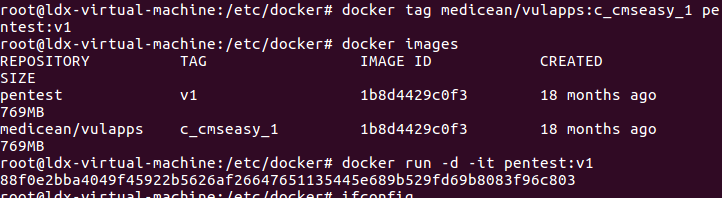
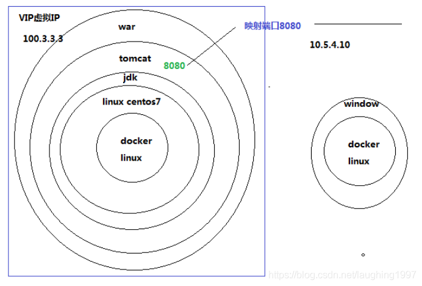

## Docker

## docker基本命令

```bash
service docker start		//开启docker服务
systemctl restart docker	//重启docker
```

```bash
docker search ubuntu  		//搜索镜像
docker pull                 //下载镜像
docker images     	        // 查看下载的镜像
docker ps                   //查看正在运行的容器
docker ps -a                // 查看容器列表

docker re/start unbuntu    //重启/开启容器ubuntu
docker stop ubuntu    	   //停止容器ubuntu
docker attach ubuntu 	   //连接容器ubuntu
docker rm ubuntu 		   //删除容器
docker rmi ubuntu 		   //删除镜像

docker run -it --name myubuntu -p 80:8080 -p 22:22 ubuntu /bin/bash  //创建并使用镜像

docker exec -it a62 /bin/bash   //进入container_id为a62的容器
```

Docker 的tag更加灵活，

Docker 将文件等信息的变动抽象为一次次的commit，每一次commit以后可能走向不同的分支，

当我们完成Docker file的构建后，会生成一串无规则的字符串代表此次生成的ID，

此时，tag的作用就是为他创建一个友好的名称，方便我们对镜像库的管理

```bash
docker tag medicean/vulapps:c_cmseasy_1 pentest:v1   //命名tag
```



```bash
docker run -d -it pentest:v1 	    //启动进程，并守护进程  -d用来开启后台守护进程
docker exec -it 88f /bin/bash		//进入镜像中的shell
service --status-all				//查看开启的服务
```

​	

```
docker restart 容器ID    //重启
```

如果直接建立容器，不映射端口的话，只能通过docker的IP访问网站。

```bash
 docker run -d -it -p 8080:80 pentest:v1	//端口映射
```

就能直接通过虚拟机ip加端口访问 

进入容器

```bash
docker attach 容器ID
docker exec -it 容器ID /bin/bash 
```

退出容器

```bash
exit  或
Ctrl+P+Q
```

[如何创建一个docker镜像](https://linux.cn/article-9541-1.html)
[如何使用Dockerhub](https://linux.cn/article-9551-1.html)


#### 将容器的状态保存为镜像

```bash
docker commit c43c web1  //容器ID，镜像名
```

更为标准的如下：

```bash
$ sudo docker commit -m "Added json gem" -a "Docker Newbee" 0b2616b0e5a8 ouruser/sinatra:v2
//其中，-m 来指定提交的说明信息，跟我们使用的版本控制工具一样；-a 可以指定更新的用户信息；
//之后是用来创建镜像的容器的 ID；最后指定目标镜像的仓库名和 tag 信息。创建成功后会返回这个镜像的 ID 信息。
```

将主机/www/runoob目录拷贝到容器96f7f14e99ab的/www目录下。

```bash
docker cp /www/runoob 96f7f14e99ab:/www/
```

将主机/www/runoob目录拷贝到容器96f7f14e99ab中，目录重命名为www。

```bash
docker cp /www/runoob 96f7f14e99ab:/www
```

将容器96f7f14e99ab的/www目录拷贝到主机的/tmp目录中。

```bash
docker cp  96f7f14e99ab:/www /tmp/
```

#### 存储镜像

如果要导出镜像到本地文件，可以使用 docker save 命令。

```bash
docker save -o web.tar web1
```


## 什么是Docker

Docker是一个进程，一启动就两个进程，一个服务，一个守护进程。占用资源非常少，启动速度非常快，1s。
一台机器上vm虚拟机能开启3到10个实例。而ocker可以开启100到10000个容器。

docker会自动给docker容器配置一个虚拟ip地址

### 从应用架构角度理解Docker

刚开始，你只需要写一个Node.js程序，挂载一个静态网站；

然后，你做了一个用户账号系统，这时需要数据库了，比如说MySQL; 

后来，为了提升性能，你引入了Memcached缓存；

终于有一天，你决定把前后端分离，这样可以提高开发效率；当用户越来越多，你又不得不使用Nginx做反向代理; 对了，随着功能越来越多，你的应用依赖也会越来越多…

总之，你的应用架构只会越来越复杂。不同的组件的安装，配置与运行步骤各不相同，于是你不得不写一个很长的文档给新同事，只为了让他搭建一个**开发环境**。

使用Docker的话，你可以为不同的组件逐一编写Dockerfile，分别构建镜像，然后运行在各个容器中。

这样做，将复杂的架构统一了，所有组件的安装和运行步骤统一为几个简单的命令:

- 构建Docker镜像: docker build
- 上传Docker镜像: docker push
- 下载Docker镜像: docker pull
- 运行Docker容器: docker run

### 从应用部署角度理解Docker

通常，你会有**开发**，**测试**和**生产**服务器，对于某些应用，还会需要进行**构建**。

不同步骤的依赖会有一些不同，并且在不同的服务器上执行。

如果手动地在不同的服务器上安装依赖，是件很麻烦的事情。

比如说，当你需要为Node.js应用添加一个新的npm模块，或者升级一下Node.js，是不是得重复操作很多次？

友情提示一下，手动敲命令是极易出错的，有些失误会导致致命的后果（参考Gitlab误删数据库与AWS的S3故障）。

如果使用Docker的话，**开发**、**构建**、**测试**、**生产**将全部在Docker容器中执行，你需要为不同步骤编写不同的Dockerfile。

当依赖变化时，仅需要稍微修改Dockerfile即可。结合构建工具[Jenkins](https://link.zhihu.com/?target=https%3A//jenkins.io/)，就可以将整个部署流程自动化。

另一方面，Dockerfile将Docker镜像描述得非常精准，能够保证很强的一致性。

比如，操作系统的版本，Node.js的版本，NPM模块的版本等。

这就意味着，在本地开发环境运行成功的镜像，在**构建**、**测试**、**生产**环境中也没有问题。

还有，不同的Docker容器是依赖于不同的Docker镜像，这样他们互不干扰。

比如，两个Node.js应用可以分别使用不同版本的Node.js。

### 从集群管理角度理解Docker

架构规模越来越大的时候，你有必要引入集群了。

这就意味着，服务器由1台变成了多台，同一个应用需要运行多个备份来分担负载。

当然，你可以手动对集群的功能进行划分: Nginx服务器，Node.js服务器，MySQL服务器，测试服务器，生产服务器…这样做的好处是简单粗暴；也可以说财大气粗，因为资源闲置会非常严重。

还有一点，每次新增节点的时候，你就不得不花大量时间进行安装与配置，这其实是一种低效的重复劳动。

下载Docker镜像之后，Docker容器可以运行在集群的任何一个节点。

一方面，各个组件可以共享主机，且互不干扰；

另一方面，也不需要在集群的节点上安装和配置任何组件。

至于整个Docker集群的管理，业界有很多成熟的解决方案，例如[Mesos](https://link.zhihu.com/?target=http%3A//mesos.apache.org/)，[Kubernetes](https://link.zhihu.com/?target=https%3A//kubernetes.io/)与[Docker Swarm](https://link.zhihu.com/?target=https%3A//github.com/docker/swarm)。

这些集群系统提供了**调度**，**服务发现**，**负载均衡**等功能，让整个集群变成一个整体。


**docker可以产生基础镜像，每加一层新的内容也形成新的镜像。每个镜像都可以去在加新的内容。变化无穷，复用资源。**


docker安装其它产品有两种方式
方式一：通过拉取事先别人做好的镜像
方式二：通过Dockerfile来构建新的镜像

[ 参考文章：当 Node.js 遇见Docker  ](https://blog.fundebug.com/2017/03/27/nodejs-docker/)

