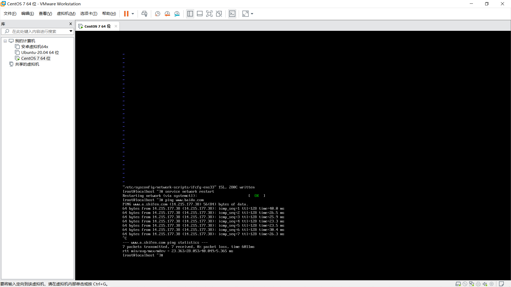

# 言叶之庭

这里主要是我个人服务器部署，以及搭建动态网站的点点滴滴记录

大部分涉及到的是运维相关知识~


## 服务器

操作系统主要为 ubuntu 18.04 LTS，ubuntu操作较为简便，且可以安装图形化版本，适合个人，CentOS（redhat社区版）更适合做大服务器  [centOS下载](https://www.centos.org/centos-linux/)

这里不多做解释相关Linux基础知识 

常用开放端口，比如80(web)、443(https)、21(ftp)、22(ssh)、3306(mysql)等


## 虚拟机

### 1.新建一个centOS7 虚拟机 



`ping 127.0.0.1`    然后   `ping www.baidu.com`	测试虚拟机能否正常联网 

如果百度ping不通，说明没有IP或者你没有启用联网功能，此时请更改网络配置文件

```bash
vi /etc/sysconfig/network-scripts/ifcfg-ens33  //用vi编辑器打开网络配置文件
ONBOOT=no----->ONBOOT=yes	//修改这一项，即 开机启动该网卡
service network restart		//网络重启
```

关于vim编辑器的使用： 打开后按a或者i才能进入编辑模式，编辑完后按esc退出编辑模式，变成命令模式，然

​	后再输入：即可跳转至末行，最后输入x命令即可保存。

#注：`vi /etc/sysconfig/network-scripts/ifcfg-ens33`   网络配置文件名可能会有不同，在输入到ifcfg时，可以连续按两下tab键，获取提示，比如我的机器 为 ifcfg-ens33

完整网络配置内容如下：

```bash
TYPE=Ethernet
BOOTPROTO=static              #静态连接
NAME=ens33
UUID=1f093d71-07de-4ca5-a424-98e13b4e9532 
DEVICE=ens33 
ONBOOT=yes                    #网络设备开机启动 
IPADDR=192.168.0.101          #192.168.59.x, x为3~255. 
NETMASK=255.255.255.0         #子网掩码 
GATEWAY=192.168.66.2          #网关IP
DNS1= 192.168.66.2
```


### 2.远程连接及建立ftp

#### Xshell连接虚拟机

在虚拟机中输入 `ifconfig`，显示虚拟机ip地址

然后在Xshell中新建会话，ssh协议，22端口，输入虚拟机root账号密码，即可维持连接登录


#### 安装vsftpd（ftp服务端） 或Xftp
安装好vsftpd后，发现root用户怎么都访问不了ftp

修改以下两个文件，将其中的root字段删除

```bash
vi /etc/vsftpd/ftpusers
vi /etc/vsftpd/user_list
```

然后重启vsftpd服务，ok，问题解决。 

```bash
service vsftpd restart
```

[深入vsftpd配置](./vsftpd)


#### 安装FileZilla Client（多线程ftp客户端）

根据虚拟机ip地址，添加站点，然后关闭**selinux**限制

先运行`getsebool -a | grep ftp` (查看selinux里有哪些关于ftp的)

```bash
allow_ftpd_anon_write –> off
allow_ftpd_full_access –> off
allow_ftpd_use_cifs –> off
allow_ftpd_use_nfs –> off
ftp_home_dir –> off
ftpd_connect_db –> off
httpd_enable_ftp_server –> off
sftpd_anon_write –> off
sftpd_enable_homedirs –> off
sftpd_full_access –> off
sftpd_write_ssh_home –> off
tftp_anon_write –> off
```

接下来我们allow_ftpd_anon_write  、 allow_ftpd_full_access 这两个ON掉。

```bash
setsebool -P allow_ftpd_anon_write on 
setsebool -P allow_ftpd_full_access on
```

即可实现文件上传下载


### 3.配置Docker环境 
#### [Docker详细介绍](./docker)
#### windows版本

如果想在本地windows环境直接使用docker，可以下载 docker桌面版应用，

该应用是基于 WSL2（windows的linux子系统），来实现在windows环境即可操作linux命令，同时可以通过vscode远程连接生成的后端linux-docker环境  [WSL2的Docker远程容器入门](https://docs.microsoft.com/zh-cn/windows/wsl/tutorials/wsl-containers)

但是WSL2需要开启Hyper-V和Device/Credential Guard服务，会造成与VMware冲突，不能启动虚拟机（新版本好像已经解决该冲突）

ps：如果已经存在上述冲突问题，可使用如下方法解决

```
WIN+R打开运行，然后输入services.msc回车;
找到 HV主机服务，双击打开设置为禁用；
打开Windows PowerShell（管理员）;
运行命令：bcdedit /set hypervisorlaunchtype off；
然后重启
```

因为WSL2占用内存较大，我使用的是在VM虚拟机centos系统中直接配置docker环境

#### centOS版本

docker的安装要求64位系统且内核版本大于3.10。所以如果是centos的话，必须安装CentOS7.0或以上版本。

```shell
yum -y update // 全系统的软件版本升级
uname -r  //3.10.0-1160.el7.x86_64 查看内核版本
```

安装方法

```bash
yum install -y yum-utils	//yum安装依赖包工具
yum-config-manager \		//设置阿里云镜像仓库
    --add-repo \
    http://mirrors.aliyun.com/docker-ce/linux/centos/docker-ce.repo
yum makecache fast			//更新yum源后更新索引，生成缓存提高搜索速度，yum clean all可清除
yum install docker-ce docker-ce-cli containerd.io	//安装docker引擎
systemctl start docker		//启动docker
docker run hello-world		//验证是否可用
docker version		//查看docker版本
```


#### 配置centos下阿里云镜像加速

修改daemon配置文件

```bash
sudo mkdir -p /etc/docker
sudo tee /etc/docker/daemon.json <<-'EOF'
{
  "registry-mirrors": ["https://ytvgdcuq.mirror.aliyuncs.com"]
}
EOF
sudo systemctl daemon-reload
sudo systemctl restart docker
```

#### 卸载docker

```bash
yum remove docker-ce docker-ce-cli containerd.io	//卸载依赖
rm -rf /var/lib/docker 		//删除资源
```


### 4.使用docker搭建镜像


## 更多

新手推荐使用： [宝塔面板](https://www.bt.cn/)

外链：[如何搭建个人独立博客](https://www.zhihu.com/question/20463581/answer/51381121)

##### 推荐一些我遇到的觉得好看的个人博客网站：

MRJU ： https://mrju.cn/

蔡 ：http://aka.cjzblog.top/

柏荧的博客：http://qiubaiying.vip/

