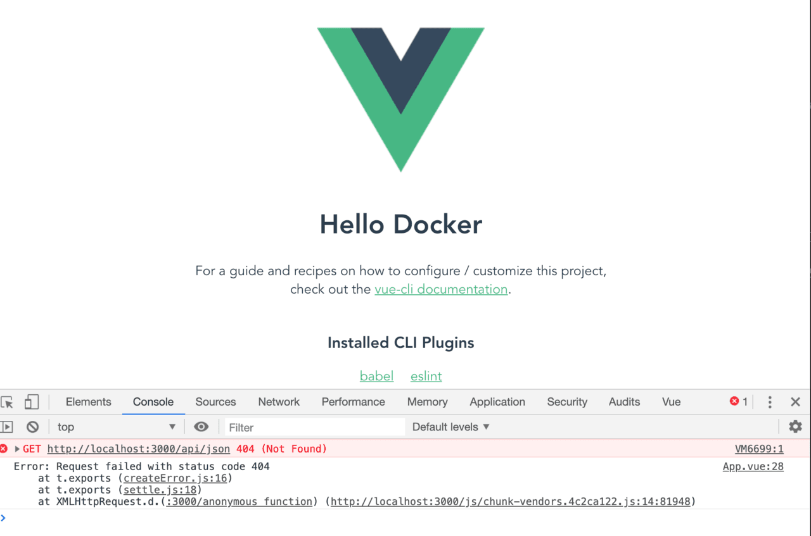
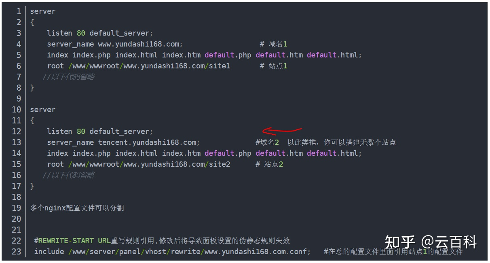

这里主要是我个人服务器部署多种应用，以及搭建动态网站的点点滴滴记录

大部分涉及到的是运维相关知识~


## 服务器

操作系统主要为 ubuntu 18.04 LTS，ubuntu操作较为简便，且可以安装图形化版本，适合个人，CentOS（redhat社区版）更适合做大服务器  [centOS下载](https://www.centos.org/centos-linux/)

这里不多做解释相关Linux基础知识 ，如果看不懂，请看本章后半段 **虚拟机教程**

常用开放端口，比如80(web)、443(https)、21(ftp)、22(ssh)、3306(mysql)等


### 一、使用docker构建 Vue 应用镜像

#### 获取 Nginx 镜像

```
service docker start  //记得启动docker
docker pull nginx
```

- Docker镜像（Image）一个特殊的文件系统。Docker 镜像是一个特殊的文件系统，除了提供容器运行时所需的程序、库、资源、配置等文件外，还包含了一些为运行时准备的一些配置参数（如匿名卷、环境变量、用户等）。 镜像不包含任何动态数据，其内容在构建之后也不会被改变。

- Docker 镜像名称由 REPOSITORY 和 TAG 组成 [REPOSITORY[:TAG]]，TAG默认为 latest。

#### 创建 Nginx Config配置文件

在项目根目录下创建 nginx 文件夹，该文件夹下新建文件 default.conf：

```nginx
server {
listen       80;
server_name  localhost;

#charset koi8-r;
access_log  /var/log/nginx/host.access.log  main;
error_log  /var/log/nginx/error.log  error;

location / {
    root   /usr/share/nginx/html;
    index  index.html index.htm;
}

#error_page  404              /404.html;
    #redirect server error pages to the static page /50x.html
#
error_page   500 502 503 504  /50x.html;
location = /50x.html {
    root   /usr/share/nginx/html;
}
} 
```


该配置文件定义了首页的指向为 /usr/share/nginx/html/index.html，所以我们可以一会把构建出来的 index.html 文件和相关的静态资源放到 /usr/share/nginx/html 目录下。

#### 创建 Dockerfile 文件

[怎么新建Dockerfile文件](./docker)

```nginx
FROM nginx
COPY dist/ /usr/share/nginx/html/
COPY nginx/default.conf /etc/nginx/conf.d/default.conf
```

- 自定义构建镜像的时候基于 Dockerfile 来构建。
- FROM nginx 命令的意思该镜像是基于 nginx:latest 镜像而构建的。
- COPY dist/ /usr/share/nginx/html/ 命令的意思是将项目根目录下 dist 文件夹下的所有文件复制到镜像中 /usr/share/nginx/html/ 目录下。
- COPY nginx/default.conf /etc/nginx/conf.d/default.conf 命令的意思是将 Nginx 目录下的 default.conf 复制到 etc/nginx/conf.d/default.conf，用本地的 default.conf 配置来替换 Nginx 镜像里的默认配置。

#### 基于该 Dockerfile 构建 Vue 应用镜像

运行命令（注意不要少了最后的 “.” ）：

```bash
docker build -t vuenginxcontainer .
```

-t 是给镜像命名，. 是基于当前目录的 Dockerfile 来构建镜像。


查看本地镜像，运行命令：

```bash
docker image ls | grep vuenginxcontainer
```


到此时我们的 Vue 应用镜像 vuenginxcontainer 已经成功创建。

接下来，我们基于该镜像启动一个 Docker 容器。

#### 启动 Vue app 容器

Docker 容器Container： 镜像运行时的实体。镜像（Image）和容器（Container）的关系，就像是面向对象程序设计中的类和实例一样，镜像是静态的定义，容器是镜像运行时的实体。容器可以被创建、启动、停止、删除、暂停等 。

基于 vuenginxcontainer 镜像启动容器，运行命令：

```bash
docker run \
-p 3000:80 \
-d --name vueApp \
vuenginxcontainer
```

- docker run 基于镜像启动一个容器
- -p 3000:80 端口映射，将宿主的3000端口映射到容器的80端口
- -d 后台方式运行
- --name 容器名，查看 Docker 进程

```bash
docker ps   //显示所有容器
```


可以发现名为 vueApp 的容器已经运行起来。此时访问 http://localhost:3000 应该就能访问到该 Vue 应用：


目前为止，已经通过 Docker 容器部署了一个静态资源服务，可以访问到静态资源文件。

***注意如果用了vue-router的history模式，要配个默认主页防止nginx或者其他服务端找不到路由直接报404。vue的dockerfile在官方文档里是有示例**


### 二、使用docker构建Node容器

再部署一个 Node 的容器来提供接口服务。

#### Express 服务

用 Node.js web 框架 Express 来写一个服务，注册一个返回 json 数据格式的路由 Server.js：

```bash
'use strict';

const express = require('express');

const PORT = 8080;
const HOST = '0.0.0.0';

const app = express();
app.get('/', (req, res) => {
res.send('Hello world\n');
});

app.get('/json', (req, res) => {
res.json({
    code: 0,
    data :'This is message from node container'
})
});

app.listen(PORT, HOST);
console.log(`Running on http://${HOST}:${PORT}`);
```


运行该 Express 应用需要 Node 环境，我们基于 Node 镜像来构建一个新镜像。

#### 获取 Node 镜像

```bash
docker pull node
```


#### 编写 Dockerfile 将 Express 应用 Docker 化

```bash
FROM node

WORKDIR /usr/src/app

COPY package*.json ./

RUN npm install

COPY . .

EXPOSE 8080
CMD [ "npm", "start" ]
```


构建镜像的时候 node_modules 的依赖直接通过 RUN npm install 来安装，项目中创建一个 .dockerignore文件来忽略一些直接跳过的文件：

```
node_modules
npm-debug.log
```


#### 构建 NodeWebServer 镜像

运行构建命令：

```bash
docker build -t nodewebserver .
```

#### 启动 NodeServer 容器

基于刚刚构建的 NodeWebServer 镜像 启动一个名为 NodeServer 的容器来提供接口服务8080端口，并映射宿主的5000端口：

```bash
docker run \
-p 5000:8080 \
-d --name nodeserver \
nodewebserver
```


查看当前 Docker 进程：

```bash
docker ps
```


可以发现 NodeServer 的容器也正常的运行起来。访问以下 http://localhost:5000/json 能访问到前面写的 json 数据。


到目前为止，后端接口服务也正常启动了。只需最后把页面请求的接口转发到后端接口服务就能调通接口。

### 跨域转发

想要将 vueApp 容器 上的请求转发到 NodeServer 容器上。首先需要知道 NodeServer 容器的 IP 地址和端口，目前已知 NodeServer 容器内部服务监听在 8080 端口，还需要知道 IP 即可。

#### 查看 NodeServer 容器的 IP 地址

查看容器内部 IP 有多种方式，这里提供两种：

1、进入容器内部查看：

```bash
docker exect -it 02277acc3efc bash
```


```bash
cat /etc/hosts
```


2、docker inspect [ containerId ] 直接查看容器信息：

```bash
docker inspect 02277acc3efc
```


在其中找到 Networks 相关配置信息：


记录下 Node 服务容器对应的 IP，一会儿配置 Nginx 转发的时候会用到。

#### 修改 Nginx 配置

Nginx 配置 Location 指向 Node 服务 default.conf （前端想要了解的Nginx，关于 Nginx 的配置已经 Location 的具体写法可以参考《[一文弄懂 Nginx 的 Location 匹配](https://juejin.im/post/5cbe89b6f265da0373718707)》）。

添加一条重写规则，将 /api/{path} 转到目标服务的 /{path} 接口上。
在前面的 nginx/default.conf 文件中加入：

```nginx
location /api/ {
rewrite  /api/(.*)  /$1  break;
proxy_pass http://172.17.0.2:8080;
} 
```


修改完了之后意识到一个问题：vueApp 容器是基于 vuenginxcontainer 这个镜像运行的，而在一开始构建镜像的时候是将 Nginx 配置 default.conf 直接构建进去了。因此如果需要修改 default.conf 还得再重新构建一个新的镜像，再基于新镜像来运行新的容器。

### 改进

能不能每次修改配置文件后直接重启容器就能让新配置生效，答案当然是有。

在构建镜像的时候 不把 Nginx 配置复制到镜像中，而是直接挂载到宿主机上，每次修改配置后，直接重启容器即可。

#### 修改 Dockerfile 文件

把 vueclidemo 项目下的 Dockerfile 修改一下：

```dockerfile
FROM nginx
COPY dist/  /usr/share/nginx/html/
COPY nginx/default.conf /etc/nginx/conf.d/default.conf
```


将 COPY nginx/default.conf /etc/nginx/conf.d/default.conf 命令删除，Nginx 配置都通过挂载命令挂载在宿主机上。再看 COPY dist/ /usr/share/nginx/html/ 命令，如果每次构建的项目 dist/ 下的内容变动都需要重新走一遍构建新镜像再启动新容器的操作，因此这条命令也可以删除，使用挂载的方式来启动容器。

#### 重新运行 Vue 应用容器

直接基于 Nginx 镜像来启动容器 vuenginxnew，运行命令：

```bash
docker run \
-p 3000:80 \
-d --name vuenginxnew \
--mount type=bind,source=$HOME/SelfWork/docker/vueclidemo/nginx,target=/etc/nginx/conf.d \
--mount type=bind,source=$HOME/SelfWork/docker/vueclidemo/dist,target=/usr/share/nginx/html \
nginx
```


- --mount type=bind,source={sourceDir},target={targetDir} 将宿主机的 sourceDir 挂载到容器的 targetDir 目录上。
- 此处运行的命令较长，如果每次重新输入难免麻烦，我们可以将完整的命令保存到一个 shell 文件 vueapp.sh 中，然后直接执行 sh vueapp.sh。


这样就能每次修改了 Nginx 配置或者重新构建了 Vue 应用的时候，只需重启容器就能立马生效。

此时我们再访问 http://localhost:3000/api/json 能看到接口能正常返回，说明转发生效了。


至此接口服务的转发也调通了。

#### 配置负载均衡

后端服务一般都是双机或者多机以确保服务的稳定性。我们可以再启动一个后端服务容器，并修改 Nginx 的配置来优化资源利用率，最大化吞吐量，减少延迟，确保容错配置。

基于前面『启动 Vue app 容器』章节的类似操作，新启动一个容器，并基于『Express 服务』章节类似的操作，查看到新容器的 IP（172.17.0.3）。

修改一下 nginx/default.conf（新增 upstream ，修改 location /api/ 中的 proxy_pass）：

```bash
upstream backend {
  server 172.17.0.2:8080;
  server 172.17.0.3:8080;
}

……

location /api/ {
  rewrite  /api/(.*)  /$1  break;
  proxy_pass backend;
} 
```

#### 写在后面

不习惯命令行的同学可以选用 Kitematic 来管理 Docker 容器的状态、数据目录和网络。所有对容量的操作都可以可视化的操作，这里就不做过多介绍了，有兴趣的同学可以自行体验下。

[参考原文](https://juejin.cn/post/6844903837774397447)

 [**更多：JAVA项目如何通过Docker实现持续部署**](https://blog.51cto.com/dadonggg/1957691)


### 三、宿主机配置nginx搭建多端口站点

#### [安装nginx](./nginx)

#### 配置nginx的配置文件nginx.conf

如果你项目上要两个或者多个vue项目 可以直接在你的80端口下新加一个location
也可以新开一个端口 也就是新建一个serve




#### 安全配置 [参照文章](https://juejin.cn/post/6966171037713219614#heading-28)

##### 禁用server_tokens项

```
server {    listen 192.168.1.250:80;    
			Server_tokens off;    
			server_name mingongge.com www.mingongge.com;    
            access_log /var/www/logs/mingongge.access.log;    
            error_log /var/www/logs/mingonggex.error.log error;    
            root /var/www/mingongge.com/public_html;    
            index index.html index.htm;
        }
#server_tokens在打开的情况下会使404页面显示Nginx的当前版本号,重启Nginx后生效

```

##### 禁止非法的HTTP User Agents

```
include /etc/nginx/blockuseragents.rules;并加入if语句设置阻止后进入的页面：
```

##### 禁掉不需要的 HTTP 方法

```
if ($request_method !~ ^(GET|HEAD|POST)$) {    return 444;}
```

##### 禁止 SSL 并且只打开 TLS

```
ssl_protocols TLSv1 TLSv1.1 TLSv1.2;
```


#### 启动nginx

```bash
cd usr/local/nginx/sbin

./nginx
```

#### 查看nginx服务是否启动成功

```bash
ps -ef | grep nginx
```

#### 平滑重启nginx服务

```bash
cd /usr/local/nginx/sbin	//nginx安装目录

./nginx -s reload
```

### 四、配置CDN
服务器搭建好后，为了提高网站速度，以及解决网站图片加载问题，我们需要配置cdn加速

免费的cdn有 BootCDN、七牛云、又拍云 ，这里选用七牛云 [免费cdn怎么选择](./cdn)

------


## 虚拟机教程

### 1.新建centOS7 虚拟机 


`ping 127.0.0.1`    然后   `ping www.baidu.com`	测试虚拟机能否正常联网 

#### 启动网卡

如果百度ping不通，说明没有IP或者你没有启用联网功能，此时请更改网络配置文件

```bash
vi /etc/sysconfig/network-scripts/ifcfg-ens33  //用vi编辑器打开网络配置文件
ONBOOT=no----->ONBOOT=yes	//修改这一项，即 开机启动该网卡
service network restart		//网络重启
```

关于vim编辑器的使用： 打开后按a或者i才能进入编辑模式，编辑完后按esc退出编辑模式，变成命令模式，然

​	后再输入：即可跳转至末行，最后输入x命令即可保存。

#注：`vi /etc/sysconfig/network-scripts/ifcfg-ens33`   网络配置文件名可能会有不同，在输入到ifcfg时，可以连续按两下tab键，获取提示，比如我的机器 为 ifcfg-ens33

完整网络配置内容如下：

```bash
TYPE=Ethernet
BOOTPROTO=static              #静态连接
NAME=ens33
UUID=1f093d71-07de-4ca5-a424-98e13b4e9532 
DEVICE=ens33 
ONBOOT=yes                    #网络设备开机启动 
IPADDR=192.168.0.101          #192.168.59.x, x为3~255. 
NETMASK=255.255.255.0         #子网掩码 
GATEWAY=192.168.157.2          #网关IP
DNS1= 8.8.8.8
DNS2=8.8.8.4
```

**DNS文件配置**

 ```bash
 vi /etc/resolv.conf 
 nameserver 8.8.8.8
 nameserver 8.8.4.4
 ```

#### 安装wget

```bash
yum -y install wget
```

#### 安装node

```bash
wget https://nodejs.org/dist/v14.7.0/node-v14.7.0-linux-x64.tar.xz  //命令行形式进行下载
```

```bash
tar -xvf node-v14.7.0-linux-x64.tar.xz								//解压
mkdir -p /usr/local/nodejs
mv node-v14.7.0-linux-x64/* /usr/local/nodejs/
```

```bash
# 建立node软链接
ln -s /usr/local/nodejs/bin/node /usr/local/bin
# 建立npm 软链接
ln -s /usr/local/nodejs/bin/npm /usr/local/bin
```

```bash
# 设置国内淘宝镜像源
npm config set registry https://registry.npm.taobao.org
# 查看设置信息
npm config list
```


### 2.远程连接及建立ftp

#### Xshell连接虚拟机

在虚拟机中输入 `ifconfig`，显示虚拟机ip地址

然后在Xshell中新建会话，ssh协议，22端口，输入虚拟机root账号密码，即可维持连接登录


#### 安装vsftpd（ftp服务端） 或Xftp

```bash
yum install -y vsftpd  //安装vsftp服务端
vim /etc/vsftpd/vsftpd.conf  //修改vsftp配置
anonymous_enable=NO		//不允许匿名访问
local_enable=YES		//允许使用本地帐户进行FTP用户登录验证
```

安装好vsftpd后，发现root用户怎么都访问不了ftp

修改以下两个文件，将其中的root字段删除

```bash
vi /etc/vsftpd/ftpusers
vi /etc/vsftpd/user_list
```

然后重启vsftpd服务，ok，问题解决。 

```bash
service vsftpd restart
```

[深入vsftpd配置](./vsftpd)


#### 安装FileZilla Client（多线程ftp客户端）

根据虚拟机ip地址，添加站点，然后关闭**selinux**限制

先运行getsebool -a | grep ftp (查看selinux里有哪些关于ftp的)

```bash
allow_ftpd_anon_write –> off
allow_ftpd_full_access –> off
allow_ftpd_use_cifs –> off
allow_ftpd_use_nfs –> off
ftp_home_dir –> off
ftpd_connect_db –> off
httpd_enable_ftp_server –> off
sftpd_anon_write –> off
sftpd_enable_homedirs –> off
sftpd_full_access –> off
sftpd_write_ssh_home –> off
tftp_anon_write –> off
```

接下来我们allow_ftpd_anon_write  、 allow_ftpd_full_access 这两个ON掉。

```bash
setsebool -P allow_ftpd_anon_write on 
setsebool -P allow_ftpd_full_access on
```

即可实现文件上传下载


### 3.配置Docker环境 
#### [Docker详细介绍](./docker)
#### windows版本

如果想在本地windows环境直接使用docker，可以下载 docker桌面版应用，

该应用是基于 WSL2（windows的linux子系统），来实现在windows环境即可操作linux命令，同时可以通过vscode远程连接生成的后端linux-docker环境  [WSL2的Docker远程容器入门](https://docs.microsoft.com/zh-cn/windows/wsl/tutorials/wsl-containers)

但是WSL2需要开启Hyper-V和Device/Credential Guard服务，会造成与VMware冲突，不能启动虚拟机（新版本好像已经解决该冲突）

ps：如果已经存在上述冲突问题，可使用如下方法解决

```
WIN+R打开运行，然后输入services.msc回车;
找到 HV主机服务，双击打开设置为禁用；
打开Windows PowerShell（管理员）;
运行命令：bcdedit /set hypervisorlaunchtype off；
然后重启
```

因为WSL2占用内存较大，我使用的是在VM虚拟机centos系统中直接配置docker环境

#### centOS版本

docker的安装要求64位系统且内核版本大于3.10。所以如果是centos的话，必须安装CentOS7.0或以上版本。

```shell
yum -y update // 全系统的软件版本升级
uname -r  //3.10.0-1160.el7.x86_64 查看内核版本
yum -y install git   //yum安装git,注意：使用yum安装的git在/usr/bin/git下
```

安装方法

```bash
yum install -y yum-utils	//yum安装依赖包工具
yum-config-manager --add-repo http://mirrors.aliyun.com/docker-ce/linux/centos/docker-ce.repo //设置阿里云镜像仓库
yum makecache fast			//更新yum源后更新索引，生成缓存提高搜索速度，yum clean all可清除
yum install docker-ce docker-ce-cli containerd.io	//安装docker引擎
systemctl start docker		//启动docker
docker run hello-world		//验证是否可用
docker version		//查看docker版本
```


#### 配置centos下阿里云镜像加速

修改daemon配置文件

```bash
mkdir -p /etc/docker
tee /etc/docker/daemon.json <<-'EOF'
{
  "registry-mirrors": ["https://ytvgdcuq.mirror.aliyuncs.com"]
}
EOF
systemctl daemon-reload
systemctl restart docker
```

#### 卸载docker

```bash
yum remove docker-ce docker-ce-cli containerd.io	//卸载依赖
rm -rf /var/lib/docker 		//删除资源
```

### 4.安装docker compose

1.运行以下命令以下载 Docker Compose 的当前稳定版本：

```
sudo curl -L "https://github.com/docker/compose/releases/download/1.24.1/docker-compose-$(uname -s)-$(uname -m)" -o /usr/local/bin/docker-compose
```

要安装其他版本的 Compose，请替换 1.24.1。

2.将可执行权限应用于二进制文件：

```
sudo chmod +x /usr/local/bin/docker-compose
```

### 5.docker配置Nginx

#### 方法一：

```
1.使用docker 下载nginx 镜像 docker pull nginx

2.启动nginx

docker run --name nginx -p 80:80 -d nginx

这样就简单的把nginx启动了，但是我们想要改变配置文件nginx.conf ，进入容器,命令：

docker exec -it nginx bash

nginx.conf配置文件在 /etc/nginx/ 下面，但是你使用vim nginx.conf 或者vi nginx.conf

会发现vi或者vim命令没有用，解决办法：apt-get update 完成之后 apt-get install vim

此时你就可以自己定制nginx.con文件了，改好配置文件之后重启容器，步骤，先把容器停了

docker stop nginx 然后重启 docker start nginx
```

#### 方法二：

```
挂载配置文件，就是把装有docker宿主机上面的nginx.conf配置文件映射到启动的nginx容器里面，这需要你首先准备好nginx.con配置文件,如果你应经准备好了，下一步是启动nginx

命令：docker run --name nginx -p 80:80 -v /home/docker-nginx/nginx.conf:/etc/nginx/nginx.conf -v /home/docker-nginx/log:/var/log/nginx -v /home/docker-nginx/conf.d/default.conf:/etc/nginx/conf.d/default.conf -d nginx

解释下上面的命令：

--name 给你启动的容器起个名字，以后可以使用这个名字启动或者停止容器

-p 映射端口，将docker宿主机的80端口和容器的80端口进行绑定

-v 挂载文件用的，第一个-v 表示将你本地的nginx.conf覆盖你要起启动的容器的nginx.conf文件，第二个表示将日志文件进行挂载，就是把nginx服务器的日志写到你docker宿主机的/home/docker-nginx/log/下面

第三个-v 表示的和第一个-v意思一样的。

-d 表示启动的是哪个镜像
```


### 6.自助git服务，私人仓库

Gogs 轻量级，图形化的git服务，方便不超过5个人的小团队在上面同步下项目，那么gogs就非常好了。安装便捷，托管/issue/wiki都有，使用简单，学习迅速，足够使用

[gogs使用方法](./gogs)

gitlab 集成比较强的ci/cd功能，也支持自家omnibus懒人包的docker安装，gitlab集成jenkins和自己设置webhook也方便，功能很多。

缺点是很重，对运行机器配置有要求，最少需要服务器4G以上运行内存，


### 7.搭建私有网盘

开源私有云盘主要有owncloud 、 sealife 、nextcloud 等等，这里使用的是Nextcloud

```bash
方法1：
docker pull nextcloud		//下载镜像
mkdir /nextcloud
docker run --name nextcloud -p 8080:80   -v /nextcloud:/var/www/html/data -d nextcloud
// -- name：设定容器名称为nextcloud

// -p 8080:80 ：端口映射，将宿主机8080端口映射到容器中的80端口

// -v /nextcloud:/var/www/html/data 将容器中项目的data目录映射到本地/nextcloud目录下方便配置

// -d nextcloud：就是刚刚所拉取的镜像名称

```

```bash
方法2：
docker run -d -p 8080:80 nextcloud   //直接拉取并运行
```

开启8080端口，访问服务器ip地址8080端口，进入nextcloud设置页面，设置账号密码，搭建即成功。

可以发现docker安装 nextcloud非常方便，1分钟即可搞定，美滋滋。

但是此时性能有一些问题，上传和下载速度比较慢，只有几百kb，网页打开会有一点顿卡。

如果说就为了保存自己的私密文件，不会频繁下载大文件，那么 此时就够用了


但是如果想优化一下的话，就需要更改许多配置了。

[详见：Nextcloud配置](./nextcloud)


## 更多

新手推荐使用： [宝塔面板](https://www.bt.cn/)

外链：[如何搭建个人独立博客](https://www.zhihu.com/question/20463581/answer/51381121)

MRJU ： https://mrju.cn/

蔡 ：http://aka.cjzblog.top/

柏荧的博客：http://qiubaiying.vip/

