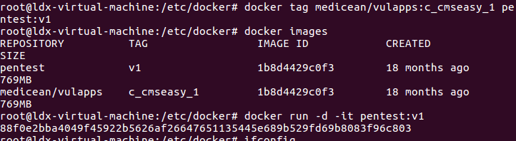

## Docker

## docker基本命令

```bash
service docker start		//开启docker服务
systemctl restart docker	//重启docker
```

```bash
docker search ubuntu  		//搜索镜像
docker pull                 //下载镜像
docker images     	        // 查看下载的镜像
docker ps                   //查看正在运行的容器
docker ps -a                // 查看容器列表

docker re/start unbuntu    //重启/开启容器ubuntu
docker stop ubuntu    	   //停止容器ubuntu
docker attach ubuntu 	   //连接容器ubuntu
docker rm ubuntu 		   //删除容器
docker rmi ubuntu 		   //删除镜像

docker run -it --name myubuntu -p 80:8080 -p 22:22 ubuntu /bin/bash  //创建并使用镜像

docker exec -it a62 /bin/bash   //进入container_id为a62的容器

/var/lib/docker/volumes/(容器名字)/_data/data  //默认docker容器数据
```

Docker 的tag更加灵活，

Docker 将文件等信息的变动抽象为一次次的commit，每一次commit以后可能走向不同的分支，

当我们完成Docker file的构建后，会生成一串无规则的字符串代表此次生成的ID，

此时，tag的作用就是为他创建一个友好的名称，方便我们对镜像库的管理

```bash
docker tag medicean/vulapps:c_cmseasy_1 pentest:v1   //命名tag
```



```bash
docker run -d -it pentest:v1 	    //启动进程，并守护进程  -d用来开启后台守护进程
docker exec -it 88f /bin/bash		//进入镜像中的shell
service --status-all				//查看开启的服务
```

​	

```
docker restart 容器ID    //重启
```

如果直接建立容器，不映射端口的话，只能通过docker的IP访问网站。

```bash
 docker run -d -it -p 8080:80 pentest:v1	//端口映射
```

就能直接通过虚拟机ip加端口访问 

进入容器

```bash
docker attach 容器ID
docker exec -it 容器ID /bin/bash 
```

退出容器

```bash
exit  或
Ctrl+P+Q
```


## docker使用流程

```
docker build -t xxl .	//构建images

docker run -p 808:80 -d --name xxl xxl			//新建容器并运行，命名
```


```
/usr/local/nginx/conf					// nginx默认位置

cd /usr/local/nginx/sbin	//nginx安装目录
./nginx -s reload					//重启nginx
```


```
1.登录dockerhub

docker login

2.修改正确的镜像名

注意要保证image的tag是账户名，如果镜像名字不对，需要改一下tag

语法是： docker tag 仓库名 用户名/仓库名

docker tag zero/centos-vim 用户名/centos-vim

3.推送docker image到dockerhub

docker push 用户名/镜像名

4.在dockerhub中检查镜像

https://hub.docker.com/

5.拉取

docker pull suyanye/syy-xxl:latest
```


### 新建一个Docker镜像

#### 1.新建一个目录和一个Dockerfile

```bash
# mkdir suui
# cd suui
# touch Dockerfile
```

用文本编辑器打开Dockerfile文件，我喜欢用nano，因为简单操作，也可以用vim

Dockerfile中每一条指令都创建镜像的一层，例如：

```bash
# This is a comment 
FROM ubuntu:14.04 
MAINTAINER  Docker Newbee <newbee@docker.com> 
RUN apt-get -qq update 
RUN apt-get -qqy install ruby ruby-dev 
#RUN gem install suui
```

Dockerfile基本的语法是

```markdown
使用  #来注释    
FROM 指令告诉 Docker 使用哪个镜像作为基础 
接着是维护者的信息   
RUN 开头的指令会在创建中运行，比如安装一个软件包，在这里使用apt-get来安装了一些软件
```

每一个指令都会在镜像上创建一个新的层，每一个指令的前缀都必须是大写的。

第一条FROM，指定使用哪个镜像源

RUN 指令告诉docker 在镜像内执行命令，安装了什么…


#### 2.编写完成Dockerfile后可以使用docker build 来生成镜像

```bash
# docker build -t newuser/ubuntu:v3 . 
```

其中 -t 标记来添加tag，指定新的镜像的用户信息。“.”是Dockerfile所在的路径（当前目录），也可以替换为一个具体的 Dockerfile的路径。

通俗来讲：
-t ：指定要创建的目标镜像名
. ：Dockerfile 文件所在目录，可以指定Dockerfile 的绝对路径

可以看到 build进程在执行操作。

它要做的第一件事情就是上传这个Dockerfile 内容，因为所有的操作都要 依据Dockerfile来进行。

然后Dockfile中的指令被一条一条的执行。每一步都创建了一个新的容器，在容器中执行指令并提交修改。

当所有的指令都执行完毕之后，返回了最终的镜像 id。

所有的中间步骤所产生的容器都被删除和清理了。

新的镜像创建完之后我们就可以使用`docker images来查看，然后就可以使用该镜像了

*注意一个镜像不能超过127层


Docker 允许你在容器内运行应用程序， 使用 docker run 命令来在容器内运行一个应用程序。

输出Hello world,输入命令 `docker run ubuntu:14.04 /bin/echo "Hello world"`

```markdown
各个参数解析：
docker: Docker 的二进制执行文件。

run:与前面的 docker 组合来运行一个容器。

ubuntu:14.04指定要运行的镜像，Docker首先从本地主机上查找镜像是否存在，如果不存在，Docker 就会从镜像仓库 Docker Hub 下载公共镜像。

/bin/echo "Hello world": 在启动的容器里执行的命令

以上命令完整的意思可以解释为：Docker 以 ubuntu14.04镜像创建一个新容器，然后在容器里执行 bin/echo "Hello world"，然后输出结果。
```


#### 3.运行交互式的容器

通过docker的两个参数 -i -t，让docker运行的容器实现”对话”的能力

```bash
docker run -i -t ubuntu:14.04 /bin/bash
```

各个参数解析：

```markdown
-t:在新容器内指定一个伪终端或终端。
-i:允许你对容器内的标准输入 (STDIN) 进行交互。
```

可以使用ls查看当前目录下的文件，cat /proc/version查看当前系统的版本信息

运行exit命令或者使用CTRL+D来退出容器

##### 常用参数如下：

-i 让容器的标准输入保持打开

-t 分配一个伪终端

-d 容器处于守护进程运行

--name 设置容器的名字

-p 可以映射宿主机端口至容器端口，如 -p 8080:8081 ，左边为宿主机端口，右边为容器端口

-v 可以挂在宿主机目录至容器目录，如-v /data:/tmp/data，左边为宿主机目录，右边为容器目录。

如，一条实际运行容器的命令：

```bash
docker run -it -d --name my_ubuntu -p 8088:22 -v /root/ubuntu_data:/data ubuntu:latest /bin/bash
```


##### 进入容器后提示IPv4 forwarding is disabled. Networking will not work.

是没有开启转发,网桥配置完后，需要开启转发，不然容器启动后，就会没有网络，配置`/etc/sysctl.conf`,添加`net.ipv4.ip_forward=1`

```
修改配置文件：
vim /usr/lib/sysctl.d/00-system.conf
追加
net.ipv4.ip_forward=1
接着重启网络
[root@localhost mytomcat]# systemctl restart network
#进入容器，获取百度信息验证
curl baidu.com
```


#### 4.后台模式

使用以下命令创建一个以进程方式运行的容器

```bash
docker run -d ubuntu:14.04 /bin/sh -c "while true; do echo hello world; sleep 1; done"
```

#### 5.停止容器

使用`docker stop`来停止容器

------------------------------------------------


[如何创建一个docker镜像](https://linux.cn/article-9541-1.html)
[如何使用Dockerhub](https://linux.cn/article-9551-1.html)


### 将容器的状态保存为镜像

```bash
docker commit c43c web1  //容器ID，镜像名
```

更为标准的如下：

```bash
$ sudo docker commit -m "Added json gem" -a "Docker Newbee" 0b2616b0e5a8 ouruser/sinatra:v2
//其中，-m 来指定提交的说明信息，跟我们使用的版本控制工具一样；-a 可以指定更新的用户信息；
//之后是用来创建镜像的容器的 ID；最后指定目标镜像的仓库名和 tag 信息。创建成功后会返回这个镜像的 ID 信息。
```

将主机/www/runoob目录拷贝到容器96f7f14e99ab的/www目录下。

```bash
docker cp /www/runoob 96f7f14e99ab:/www/
```

将主机/www/runoob目录拷贝到容器96f7f14e99ab中，目录重命名为www。

```bash
docker cp /www/runoob 96f7f14e99ab:/www
```

将容器96f7f14e99ab的/www目录拷贝到主机的/tmp目录中。

```bash
docker cp  96f7f14e99ab:/www /tmp/
```

### 存储镜像

如果要导出镜像到本地文件，可以使用 docker save 命令。

```bash
docker save -o web.tar web1
```


#### [**通过dockerHub上传你构建的镜像**](https://hub.docker.com/)


## 什么是Docker

Docker是一个进程，一启动就两个进程，一个服务，一个守护进程。占用资源非常少，启动速度非常快，1s。
一台机器上vm虚拟机能开启3到10个实例。而ocker可以开启100到10000个容器。

docker会自动给docker容器配置一个虚拟ip地址

### 从应用架构角度理解Docker

刚开始，你只需要写一个Node.js程序，挂载一个静态网站；

然后，你做了一个用户账号系统，这时需要数据库了，比如说MySQL; 

后来，为了提升性能，你引入了Memcached缓存；

终于有一天，你决定把前后端分离，这样可以提高开发效率；当用户越来越多，你又不得不使用Nginx做反向代理; 对了，随着功能越来越多，你的应用依赖也会越来越多…

总之，你的应用架构只会越来越复杂。不同的组件的安装，配置与运行步骤各不相同，于是你不得不写一个很长的文档给新同事，只为了让他搭建一个**开发环境**。

使用Docker的话，你可以为不同的组件逐一编写Dockerfile，分别构建镜像，然后运行在各个容器中。

这样做，将复杂的架构统一了，所有组件的安装和运行步骤统一为几个简单的命令:

- 构建Docker镜像: docker build
- 上传Docker镜像: docker push
- 下载Docker镜像: docker pull
- 运行Docker容器: docker run

### 从应用部署角度理解Docker

通常，你会有**开发**，**测试**和**生产**服务器，对于某些应用，还会需要进行**构建**。

不同步骤的依赖会有一些不同，并且在不同的服务器上执行。

如果手动地在不同的服务器上安装依赖，是件很麻烦的事情。

比如说，当你需要为Node.js应用添加一个新的npm模块，或者升级一下Node.js，是不是得重复操作很多次？

友情提示一下，手动敲命令是极易出错的，有些失误会导致致命的后果（参考Gitlab误删数据库与AWS的S3故障）。

如果使用Docker的话，**开发**、**构建**、**测试**、**生产**将全部在Docker容器中执行，你需要为不同步骤编写不同的Dockerfile。

当依赖变化时，仅需要稍微修改Dockerfile即可。结合构建工具[Jenkins](https://link.zhihu.com/?target=https%3A//jenkins.io/)，就可以将整个部署流程自动化。

另一方面，Dockerfile将Docker镜像描述得非常精准，能够保证很强的一致性。

比如，操作系统的版本，Node.js的版本，NPM模块的版本等。

这就意味着，在本地开发环境运行成功的镜像，在**构建**、**测试**、**生产**环境中也没有问题。

还有，不同的Docker容器是依赖于不同的Docker镜像，这样他们互不干扰。

比如，两个Node.js应用可以分别使用不同版本的Node.js。

### 从集群管理角度理解Docker

架构规模越来越大的时候，你有必要引入集群了。

这就意味着，服务器由1台变成了多台，同一个应用需要运行多个备份来分担负载。

当然，你可以手动对集群的功能进行划分: Nginx服务器，Node.js服务器，MySQL服务器，测试服务器，生产服务器…这样做的好处是简单粗暴；也可以说财大气粗，因为资源闲置会非常严重。

还有一点，每次新增节点的时候，你就不得不花大量时间进行安装与配置，这其实是一种低效的重复劳动。

下载Docker镜像之后，Docker容器可以运行在集群的任何一个节点。

一方面，各个组件可以共享主机，且互不干扰；

另一方面，也不需要在集群的节点上安装和配置任何组件。

至于整个Docker集群的管理，业界有很多成熟的解决方案，例如[Mesos](https://link.zhihu.com/?target=http%3A//mesos.apache.org/)，[Kubernetes](https://link.zhihu.com/?target=https%3A//kubernetes.io/)与[Docker Swarm](https://link.zhihu.com/?target=https%3A//github.com/docker/swarm)。

这些集群系统提供了**调度**，**服务发现**，**负载均衡**等功能，让整个集群变成一个整体。


**docker可以产生基础镜像，每加一层新的内容也形成新的镜像。每个镜像都可以去在加新的内容。变化无穷，复用资源。**


docker安装其它产品有两种方式
方式一：通过拉取事先别人做好的镜像
方式二：通过Dockerfile来构建新的镜像

[ 参考文章：当 Node.js 遇见Docker  ](https://blog.fundebug.com/2017/03/27/nodejs-docker/)

