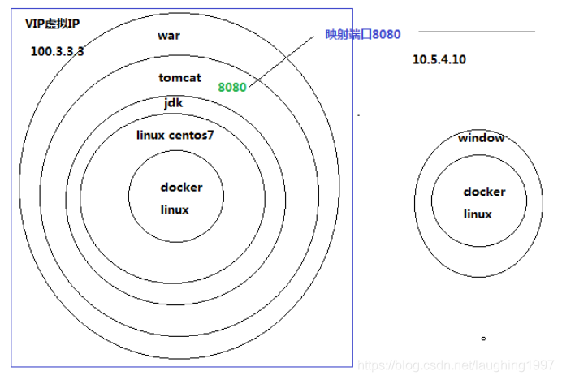

## Docker

## docker基本命令

```bash
service docker start		//开启docker服务
systemctl restart docker	//重启docker
```

```bash
docker search ubuntu  		//搜索镜像
docker pull                 //下载镜像
docker images     	        // 查看下载的镜像
docker ps                   //查看正在运行的容器
docker ps -a                // 查看容器列表

docker re/start unbuntu    //重启/开启容器ubuntu
docker stop ubuntu    	   //停止容器ubuntu
docker attach ubuntu 	   //连接容器ubuntu
docker rm ubuntu 		   //删除容器
docker rmi ubuntu 		   //删除镜像

docker run -it --name myubuntu -p 80:8080 -p 22:22 ubuntu /bin/bash  //创建并使用镜像

docker exec -it a62 /bin/bash   //进入container_id为a62的容器

/var/lib/docker/volumes/(容器名字)/_data/data  //默认docker容器数据
```

Docker 的tag更加灵活，

Docker 将文件等信息的变动抽象为一次次的commit，每一次commit以后可能走向不同的分支，

当我们完成Docker file的构建后，会生成一串无规则的字符串代表此次生成的ID，

此时，tag的作用就是为他创建一个友好的名称，方便我们对镜像库的管理

```bash
docker tag medicean/vulapps:c_cmseasy_1 pentest:v1   //命名tag
```


```bash
docker run -d -it pentest:v1 	    //启动进程，并守护进程  -d用来开启后台守护进程
docker exec -it 88f /bin/bash		//进入镜像中的shell
service --status-all				//查看开启的服务
```

​	

```
docker restart 容器ID    //重启
```

如果直接建立容器，不映射端口的话，只能通过docker的IP访问网站。

```bash
 docker run -d -it -p 8080:80 pentest:v1	//端口映射
```

就能直接通过虚拟机ip加端口访问 

进入容器

```bash
docker attach 容器ID
docker exec -it 容器ID /bin/bash 
```

退出容器

```bash
exit  或
Ctrl+P+Q
```


## docker使用流程

```bash
docker build -t xxl .	//构建images

docker run -p 808:80 -d --name xxl xxl			//新建容器并运行，命名
```


```
/usr/local/nginx/conf					// nginx默认位置

cd /usr/local/nginx/sbin	//nginx安装目录
./nginx -s reload					//重启nginx
```


```bash
1.登录dockerhub

docker login

2.修改正确的镜像名

注意要保证image的tag是账户名，如果镜像名字不对，需要改一下tag

语法是： docker tag 仓库名 用户名/仓库名

docker tag zero/centos-vim 用户名/centos-vim

3.推送docker image到dockerhub

docker push 用户名/镜像名

4.在dockerhub中检查镜像

https://hub.docker.com/

5.拉取

docker pull suyanye/syy-xxl:latest
```


### 新建一个Docker镜像

#### 1.新建一个目录和一个Dockerfile

```bash
# mkdir suui
# cd suui
# touch Dockerfile
```

用文本编辑器打开Dockerfile文件，我喜欢用nano，因为简单操作，也可以用vim

Dockerfile中每一条指令都创建镜像的一层，例如：

```bash
# This is a comment 
FROM ubuntu:14.04 
MAINTAINER  Docker Newbee <newbee@docker.com> 
RUN apt-get -qq update 
RUN apt-get -qqy install ruby ruby-dev 
#RUN gem install suui
```

Dockerfile基本的语法是

```markdown
使用  #来注释    
FROM 指令告诉 Docker 使用哪个镜像作为基础 
接着是维护者的信息   
RUN 开头的指令会在创建中运行，比如安装一个软件包，在这里使用apt-get来安装了一些软件
```

每一个指令都会在镜像上创建一个新的层，每一个指令的前缀都必须是大写的。

第一条FROM，指定使用哪个镜像源

RUN 指令告诉docker 在镜像内执行命令，安装了什么…


#### 2.编写完成Dockerfile后可以使用docker build 来生成镜像

```bash
# docker build -t newuser/ubuntu:v3 . 
```

其中 -t 标记来添加tag，指定新的镜像的用户信息。“.”是Dockerfile所在的路径（当前目录），也可以替换为一个具体的 Dockerfile的路径。

通俗来讲：
-t ：指定要创建的目标镜像名
. ：Dockerfile 文件所在目录，可以指定Dockerfile 的绝对路径

可以看到 build进程在执行操作。

它要做的第一件事情就是上传这个Dockerfile 内容，因为所有的操作都要 依据Dockerfile来进行。

然后Dockfile中的指令被一条一条的执行。每一步都创建了一个新的容器，在容器中执行指令并提交修改。

当所有的指令都执行完毕之后，返回了最终的镜像 id。

所有的中间步骤所产生的容器都被删除和清理了。

新的镜像创建完之后我们就可以使用`docker images来查看，然后就可以使用该镜像了

*注意一个镜像不能超过127层


Docker 允许你在容器内运行应用程序， 使用 docker run 命令来在容器内运行一个应用程序。

输出Hello world,输入命令 `docker run ubuntu:14.04 /bin/echo "Hello world"`

```markdown
各个参数解析：
docker: Docker 的二进制执行文件。

run:与前面的 docker 组合来运行一个容器。

ubuntu:14.04指定要运行的镜像，Docker首先从本地主机上查找镜像是否存在，如果不存在，Docker 就会从镜像仓库 Docker Hub 下载公共镜像。

/bin/echo "Hello world": 在启动的容器里执行的命令

以上命令完整的意思可以解释为：Docker 以 ubuntu14.04镜像创建一个新容器，然后在容器里执行 bin/echo "Hello world"，然后输出结果。
```


#### 3.运行交互式的容器

通过docker的两个参数 -i -t，让docker运行的容器实现”对话”的能力

```bash
docker run -i -t ubuntu:14.04 /bin/bash
```

各个参数解析：

```markdown
-t:在新容器内指定一个伪终端或终端。
-i:允许你对容器内的标准输入 (STDIN) 进行交互。
```

可以使用ls查看当前目录下的文件，cat /proc/version查看当前系统的版本信息

运行exit命令或者使用CTRL+D来退出容器

##### 常用参数如下：

-i 让容器的标准输入保持打开

-t 分配一个伪终端

-d 容器处于守护进程运行

--name 设置容器的名字

-p 可以映射宿主机端口至容器端口，如 -p 8080:8081 ，左边为宿主机端口，右边为容器端口

-v 可以挂在宿主机目录至容器目录，如-v /data:/tmp/data，左边为宿主机目录，右边为容器目录。

如，一条实际运行容器的命令：

```bash
docker run -it -d --name my_ubuntu -p 8088:22 -v /root/ubuntu_data:/data ubuntu:latest /bin/bash
```


##### 进入容器后提示IPv4 forwarding is disabled. Networking will not work.

是没有开启转发,网桥配置完后，需要开启转发，不然容器启动后，就会没有网络，配置`/etc/sysctl.conf`,添加`net.ipv4.ip_forward=1`

```
修改配置文件：
vim /usr/lib/sysctl.d/00-system.conf
追加
net.ipv4.ip_forward=1
接着重启网络
[root@localhost mytomcat]# systemctl restart network
#进入容器，获取百度信息验证
curl baidu.com
```


#### 4.后台模式

使用以下命令创建一个以进程方式运行的容器

```bash
docker run -d ubuntu:14.04 /bin/sh -c "while true; do echo hello world; sleep 1; done"
```

#### 5.停止容器

使用`docker stop`来停止容器

------------------------------------------------


[如何创建一个docker镜像](https://linux.cn/article-9541-1.html)
[如何使用Dockerhub](https://linux.cn/article-9551-1.html)


## 设置开机启动--随容器的启动而启动服务

刚开始玩docker时，可以基于系统级别的镜像做定制，比如基于 centos 镜像使用docker；

```
docker pull centos:7        # 把镜像拉下来
docker run -it centos:7        # 创建一个容器即可运行
```

　　你可以在拉下来的容器里安装任何需要的应用（必要的）；然后，一切都看起来很美好！

　　但是，这时，我们最担心一个问题，那就是docker挂了怎么办？机器重启后怎么办？

　　是的，这个担心是有道理的，如果你没有去查细细看过官方文档，那么多半你是吃过这亏，才会清楚其中的坑！

所以，我们来提几个问题？ 简单而不简约！

#### 1. 如何备份当前容器的修改？备份是可靠性的一个保证！

　　1. 使用commit 命令保存到本地

```
docker commit -m "msg" abcommitid myimage:1.0
```

　　其好处是操作方便，本机永久保存，方便下次快速操作。坏处，也不算，就是你如果想放到远程，你必须注册一个docker hub 账号，然后保存过去。而且这样的镜像，一般只适合自己使用，不适合团队传播！（不过也不是绝对的）

　　2. 使用docker save 保存压缩包到本地

```
docker save -o myimage_save.tar abcontainerid 
```

　　这样备份好之后，就可以将改该容器到处分发到其他机器或者做备份了。这样做都好处是，传播方便，不会导致隐私泄露。坏处是都是本地包，没有存储在云端，必须到处携带该包。

　　导入时使用 docker load 即可！

```
docker load -i myimage_save.tar
```

　　然后就可以看到镜像了，使用docker run 运行。操作步骤稍微繁琐了点。注意: 只有 docker run 才能自定义各种参数哦。（docker run 聚合了 create 和 start 的功能）

　　在部署应用时可能存在需要将新应用部署好后，再删除原容器的操作，所以容器重命名就很有必要的, 使用 docker rename

```
docker rename 原容器名  新容器名
```

　　3. 使用 docker export 保存到本地, 操作如同 docker save, 但是功能受限，个人不是很喜欢使用

```
docker export -o mycontainer_save.tar tmp_container
```

#### 2. 如何设置应用开机启动？只要启动容器就够了！

　　应用场景可以说是刚需: 我把第一个镜像安装好后，希望下次创建容器之后就能自动运行，而不是还要操作N多繁杂步骤，从而降低移植性带来的方便性！

　　1. 能想得最简单的是，使用系统的开机启动功能

　　　　比如在 /etc/rc.d/rc.local 中添加相应的启动，但是这里有个前提，那就是你必须先把容器启起来; （启不启得来另说）

　　2. 使用docker的开机自动运行功能，使用简单;

　　　　这里说的简单是指使用，而在操作的时候则看个人了。在docker创建时，使用启动脚本，自动运行。主要的命令有: CMD, RUN, ADD . 创建一个start.sh,可以定复杂的启动逻辑;但是这在后期中，就很难更改其逻辑了哦！

```
CMD ["sh", "-c", "service httpd start;bash"]        # 开机启动 apache 服务
```

#### 3. 如何自定义端口映射？容器需要与外部通信！

　　Docker 自带了端口映射功能，使用docker run -p 进行操作！

```
docker run -d -p 81:80 --name container_name myimage:1.0
```

　　多个端口映射使用多个-p即可;

#### 4. 如何自定义hostname？订制你的机器名而不是随机数！

　　自定义host也很有用，比如我想看我当前气息环境，hostname就很有用，还有hostname的固定可以不致让自己迷失; 只需要使用-h参数就可以了。

```
docker run -d -h myapi1 myimage:1.0 
```

#### 5. 如何插入host的解析？容器内订制自己的 hosts ！

　　这种应用场景是，比如你其他应用的服务，为了防止ip经常变更导致的麻烦性，这种服务一般是以内网域名形式出现，所以需要加入域名解析。

　　方法一是，你给每个容器定义一个通用的域名解析器dns; 

　　方法二是，为各自的hosts里加入解析。而这在docker中，则操作是不会被保存的，每个新容器老是新 hosts. 可以通过 --add-host 添加自定义hosts解析:

```
docker run --add-host a.com:1.2.3.4 myimage:1.0
```

　　这种方式仅用于学习，其中更有用的是加入一个dns; 其操作步骤就是安装个bind 软件，然后配制 named.conf 即可。使用时，vim /etc/resolv.conf

```
nameserver 100.1.1.1
```

#### 6. 如何自定义自己都的变量以满足容器内动态修改的需求？特殊场景定制化！

　　其实如上的配置基本能满足大部分情况下的生产需求了。但是难免还是个性的，比如我想定义nginx访问某个的另外端口，这时使用dns 就不好搞了。在不改变外部环境的情况下，我们只能自定义修改了。最直接的方式是在 nginx 中直接改掉即可。但是这样做还有个，如果我想让同一个容器灵活地指向任意端口怎么办？那就只能自定义变量操作了，在创建容器的时候指定该端口即可。

　　这样的自定义变量可以用于设置 nginx 的自定义端口, java 堆大小，日志目录设置等等.

　　具体做法步骤如下:

```bash
# 1. docker run -it myimage:1.0, 修改 nginx 配置文件，使其可以方便被替换,如下
# vim /usr/local/nginx/conf/conf.d/www.conf
server {
    listen       80;
    server_name  localhost;
    access_log  /var/log/nginx/host.access.log  main;
    location / {
        root   /www/webapp/html/app1;
        try_files $uri $uri/ /index.html;
        index  index.html index.htm;
    }
    location /api {
        # 设置点位符使外部可替换
        set $API_HOST 192.168.1.1;
        set $API_PORT 8083;
        proxy_pass   http://$API_HOST:$API_PORT;
        index  index.html index.htm;
    }
}
# 2. 自己尝试启动无误后，将新变更提交到原镜像, docker commit
    docker commit -m 'conf update' abcommitid myimage:1.0
# 3. vim Dockerfile, 设置启动脚本
    FROM myimage:1.0
    MAINTAINER xxx <abc@abc.com>
    ENV NGINX_CONFD_PATH /usr/local/nginx/conf/conf.d
    ENV PATH /usr/local/nginx/sbin:$PATH
    ADD ./start.sh /usr/local/bin/start.sh
    RUN chmod +x /usr/local/bin/start.sh
    EXPOSE 80
    # 设置启动脚本,脚本来源本机,可随时修改
    CMD [ "/usr/local/bin/start.sh" ]
# 4. 缩写启动脚本，使在启动时执行动态配置变更 awk
# vim start.sh
    #!/bin/bash
    # override port variable if set
    if [ ! -z "$API_PORT" ]; then
        echo "------- api port replacing to $API_PORT -----------";
        awk -v PORT="set \$API_PORT $API_PORT;" '{ sub(/set.*\$API_PORT.*/, PORT); print; }' ${NGINX_CONFD_PATH}/default.conf \
            > ${NGINX_CONFD_PATH}/default.conf.new && mv ${NGINX_CONFD_PATH}/default.conf.new ${NGINX_CONFD_PATH}/default.conf
    fi
    if [ ! -z "$API_HOST" ]; then
        echo "------- api host replacing to $API_HOST -----------";
        awk -v HOST="set \$API_HOST $API_HOST;" '{ sub(/set.*\$API_HOST.*/, HOST); print; }' ${NGINX_CONFD_PATH}/default.conf \
            > ${NGINX_CONFD_PATH}/default.conf.new && mv ${NGINX_CONFD_PATH}/default.conf.new ${NGINX_CONFD_PATH}/default.conf
    fi

    # start nginx
    /bin/sh -c 'nginx -g "daemon off;" '
# 5. 都操作好后，重新构建一个新的镜像，使用就可以了
    docker build -t myimage:1.1 .
# 6. 使用时，用 --env 来指定自定义变量
    docker run --env API_HOST=192.168.1.112 --env API_PORT=8090 -it myimage:1.1
# 此时，进入查看时，nginx已经运行在不同的api端口下了
```

　　注意: 本处使用的是比较原始的 docker 版本，如果使用到 docker-compose 等高级工具，可能就不需要这么麻烦了！

#### 7. 如何将宿主机目录与容器内目录进行交换？可视化你的容器内容！

　　这样的场景是比较多的: 

　　　　比如为了统一管理安装包，不让所有安装包散乱在各个容器的各个目录;
　　　　比如为了让容器的数据存储使用一块新买的磁盘;
　　　　比如我想复制同一份代码到新容器使用，从而方便后续独立修改;
　　　　比如你无法进入你的容器，却想拿到其中的数据等等;

　　所以，我们需要使用到目录映射功能，这是 docker 自带的功能，方便实用: -v 参数设置即可:

```bash
docker run -d -v /opt/docker/webapps:/www/webapp myimage:1.0
```

经过上面这些问答，相信你已经能简单应付docker常用运维场景了，尽情享受docker带来的可移植性方便以及其隔离性吧。

## 将容器的状态保存为镜像

```bash
docker commit c43c web1  //容器ID，镜像名
```

更为标准的如下：

```bash
$ sudo docker commit -m "Added json gem" -a "Docker Newbee" 0b2616b0e5a8 ouruser/sinatra:v2
//其中，-m 来指定提交的说明信息，跟我们使用的版本控制工具一样；-a 可以指定更新的用户信息；
//之后是用来创建镜像的容器的 ID；最后指定目标镜像的仓库名和 tag 信息。创建成功后会返回这个镜像的 ID 信息。
```

将主机/www/runoob目录拷贝到容器96f7f14e99ab的/www目录下。

```bash
docker cp /www/runoob 96f7f14e99ab:/www/
```

将主机/www/runoob目录拷贝到容器96f7f14e99ab中，目录重命名为www。

```bash
docker cp /www/runoob 96f7f14e99ab:/www
```

将容器96f7f14e99ab的/www目录拷贝到主机的/tmp目录中。

```bash
docker cp  96f7f14e99ab:/www /tmp/
```

### 存储镜像

如果要导出镜像到本地文件，可以使用 docker save 命令。

```bash
docker save -o web.tar web1
```


#### [**通过dockerHub上传你构建的镜像**](https://hub.docker.com/)


## Docker Compose

> 前面我们使用 Docker 的时候，定义 Dockerfile 文件，然后使用 docker build、docker run 等命令操作容器。然而微服务架构的应用系统一般包含若干个微服务，每个微服务一般都会部署多个实例，如果每个微服务都要手动启停，那么效率之低，维护量之大可想而知
>
> 使用 Docker Compose 可以轻松、高效的管理容器，它是一个用于定义和运行多容器 Docker 的应用程序工具

参考 https://www.jianshu.com/p/658911a8cff3


## Volume卷

### 什么是volume

volume（卷）用来存储docker持久化的数据，其实就是一个主机上的一个目录，由docker统一管理，我们知道image是只读的，在image运行时，才会加入可写层，虽然我们也可以将数据写入到可写层，但这会增加容器的大小，如果我们不想持久化数据，又不想将数据暂存在docker的可写层，可以考虑使用 tmpfs mount（以后在总结），我对volume的理解就是将主机上的一个文件映射到容器当中的某个文件，容器向其中写入数据就相当于向主机中对应的文件写入数据，官方有一幅图描述tmpfs mount与volume的不同：


 

### 匿名卷与实名卷

匿名卷即没有显示指定名字的卷，实名卷具有名字，两种卷均存储在/var/lib/docker/volumes/区域，匿名卷的目录名是一串数字，如果在创建容器是添加了-rm参数，则匿名卷会随着容器的删除而删除，其实匿名卷和实名卷基本可以看成是一个东西，只是匿名卷名字由docker随机命名，并且可以随容器的销毁而销毁而已

 

### 如何创建volume

```bash
有两种方式：
#用于为单一容器创建数据卷
docker run -v.....
#用于为集群服务创建数据卷
docker run -mount.....
```


版本高于17.06的docker可以将--mount用于为单一容器创建数据卷，两者的差别如下：

#### 1、-v或是-volume包括三个区域，以分号分割

第一个区域用于定义卷的名称，如果不指定，表明使用匿名卷，实名卷的名称在一台主机上唯一
第二个区域指定卷对应容器中的哪个文件
第三个区域是可选的，是用逗号分割的选项列表

#### 2、-mount使用键值对<key>=<value>，以逗号分割，对应的值如下

type：可以是bind、volume、tmpfs，创建数据卷使用volume
source：挂载点的名字，对于实名卷，为实名卷的名字，匿名卷不需要使用这个关键字
destination：指定卷对应容器中的哪个文件
readonly：指定数据卷只可读
volume-opt：可以出现多次，其值为一个键值对（有什么用我还不知道）
如果volume-opt中关键字对应的值出现volume-opt，需要让docker识别出这个volume-opt是一个值，如何做？

-mount参数的值用单引号包含起来，将关键字对应值中出现的volume-opt用双引号括起来，如下：

```bash
$ docker service create \
     --mount 'type=volume,src=<VOLUME-NAME>,dst=<CONTAINER-PATH>,volume-driver=local,volume-opt=type=nfs,volume-opt=device=<nfs-server>:<nfs-path>,"volume-opt=o=addr=<nfs-address>,vers=4,soft,timeo=180,bg,tcp,rw"'
    --name myservice \
    <IMAGE>
```

#### -v与-mount的区别

-mount可以支持创建集群服务的数据卷，而-v不行，其余基本没差

 

### 数据卷的几种用法

接下来文档介绍了数据卷的几种用法，在这里总结下，方便以后查阅

1、创建、查看、删除数据卷：

```bash
#可以在没有任何容器的前提下创建数据卷

#创建实名数据卷
docker volume create my-vol

#创建匿名卷
docker volume create

#查看数据卷列表
docker volume ls

#查看具体的数据卷
docker volume inspect my-vol

#删除数据卷
docker volume rm my-vol 
```

2、在创建容器时指定数据卷

```bash
#使用-mount创建实名卷
$ docker run -d \
  --name devtest \
  --mount source=myvol2,target=/app \
  nginx:latest
#使用-v创建实名卷
$ docker run -d \
  --name devtest \
  -v myvol2:/app \
  nginx:latest
```

3、在创建集群服务时指定数据卷

```bash
$ docker service create -d \
  --replicas=4 \
  --name devtest-service \
  --mount source=myvol2,target=/app \
  nginx:latest
```


4、填充数据卷

如果容器中用于映射的文件或目录不为空，则其中的数据或是文件会拷贝到数据卷中

 

5、使用只读数据卷

多个容器可以挂载在同一个数据卷上，我们可以设置某个容器对数据卷只有读权限，设置方式如下：

```bash
#ro表示只读（readonly）
$ docker run -d \
  --name=nginxtest \
  -v nginx-vol:/usr/share/nginx/html:ro \
  nginx:latest

$ docker run -d \
  --name=nginxtest \
  --mount source=nginx-vol,destination=/usr/share/nginx/html,readonly \
  nginx:latest
```


6、在多台机器上共享一个数据卷

文档原文如下：


> 总结一下：
>
> - 在应用程序中添加代码逻辑，从云存储上读写数据
>
> - 使用支持写数据到云存储的volume驱动，并使用该驱动创建数据卷（至于数据卷驱动是啥，以后用到再说）

 

7、下载数据卷驱动以及使用数据卷驱动创建数据卷

```bash
#下载vieux/sshfs驱动
$ docker plugin install --grant-all-permissions vieux/sshfs

#使用特定的驱动创建数据卷（-driver）
$ docker volume create --driver vieux/sshfs \
  -o sshcmd=test@node2:/home/test \
  -o password=testpassword \
  sshvolume

#创建容器时使用特定驱动创建数据卷（-volume-driver）
$ docker run -d \
  --name sshfs-container \
  --volume-driver vieux/sshfs \
  --mount src=sshvolume,target=/app,volume-opt=sshcmd=test@node2:/home/test,volume-opt=password=testpassword \
  nginx:latest
```


8、移除数据卷（与之前的部分有重复）

（1）移除匿名卷

```bash
#-rm：删除容器时会删除容器对应的匿名卷，拿下面的例子来说，删除busybox容器时，会删除/foo对应的匿名卷，但是不会删除awesome
$ docker run --rm -v /foo -v awesome:/bar busybox top
```

（2）根据名字移除卷

```bash
docker volume rm awesome
```

（3）移除所有数据卷

```bash
#docker规定，没有容器正在使用数据卷后才允许删除该数据卷
$ docker volume prune
```

9、其他

volume-from可以从另一个容器当中挂载容器中已经创建好的数据卷


## 什么是Docker

Docker是一个进程，一启动就两个进程，一个服务，一个守护进程。占用资源非常少，启动速度非常快，1s。
一台机器上vm虚拟机能开启3到10个实例。而ocker可以开启100到10000个容器。

docker会自动给docker容器配置一个虚拟ip地址

### 从应用架构角度理解Docker

刚开始，你只需要写一个Node.js程序，挂载一个静态网站；

然后，你做了一个用户账号系统，这时需要数据库了，比如说MySQL; 

后来，为了提升性能，你引入了Memcached缓存；

终于有一天，你决定把前后端分离，这样可以提高开发效率；当用户越来越多，你又不得不使用Nginx做反向代理; 对了，随着功能越来越多，你的应用依赖也会越来越多…

总之，你的应用架构只会越来越复杂。不同的组件的安装，配置与运行步骤各不相同，于是你不得不写一个很长的文档给新同事，只为了让他搭建一个**开发环境**。

使用Docker的话，你可以为不同的组件逐一编写Dockerfile，分别构建镜像，然后运行在各个容器中。

这样做，将复杂的架构统一了，所有组件的安装和运行步骤统一为几个简单的命令:

- 构建Docker镜像: docker build
- 上传Docker镜像: docker push
- 下载Docker镜像: docker pull
- 运行Docker容器: docker run

### 从应用部署角度理解Docker

通常，你会有**开发**，**测试**和**生产**服务器，对于某些应用，还会需要进行**构建**。

不同步骤的依赖会有一些不同，并且在不同的服务器上执行。

如果手动地在不同的服务器上安装依赖，是件很麻烦的事情。

比如说，当你需要为Node.js应用添加一个新的npm模块，或者升级一下Node.js，是不是得重复操作很多次？

友情提示一下，手动敲命令是极易出错的，有些失误会导致致命的后果（参考Gitlab误删数据库与AWS的S3故障）。

如果使用Docker的话，**开发**、**构建**、**测试**、**生产**将全部在Docker容器中执行，你需要为不同步骤编写不同的Dockerfile。

当依赖变化时，仅需要稍微修改Dockerfile即可。结合构建工具[Jenkins](https://link.zhihu.com/?target=https%3A//jenkins.io/)，就可以将整个部署流程自动化。

另一方面，Dockerfile将Docker镜像描述得非常精准，能够保证很强的一致性。

比如，操作系统的版本，Node.js的版本，NPM模块的版本等。

这就意味着，在本地开发环境运行成功的镜像，在**构建**、**测试**、**生产**环境中也没有问题。

还有，不同的Docker容器是依赖于不同的Docker镜像，这样他们互不干扰。

比如，两个Node.js应用可以分别使用不同版本的Node.js。

### 从集群管理角度理解Docker

架构规模越来越大的时候，你有必要引入集群了。

这就意味着，服务器由1台变成了多台，同一个应用需要运行多个备份来分担负载。

当然，你可以手动对集群的功能进行划分: Nginx服务器，Node.js服务器，MySQL服务器，测试服务器，生产服务器…这样做的好处是简单粗暴；也可以说财大气粗，因为资源闲置会非常严重。

还有一点，每次新增节点的时候，你就不得不花大量时间进行安装与配置，这其实是一种低效的重复劳动。

下载Docker镜像之后，Docker容器可以运行在集群的任何一个节点。

一方面，各个组件可以共享主机，且互不干扰；

另一方面，也不需要在集群的节点上安装和配置任何组件。

至于整个Docker集群的管理，业界有很多成熟的解决方案，例如[Mesos](https://link.zhihu.com/?target=http%3A//mesos.apache.org/)，[Kubernetes](https://link.zhihu.com/?target=https%3A//kubernetes.io/)与[Docker Swarm](https://link.zhihu.com/?target=https%3A//github.com/docker/swarm)。

这些集群系统提供了**调度**，**服务发现**，**负载均衡**等功能，让整个集群变成一个整体。


**docker可以产生基础镜像，每加一层新的内容也形成新的镜像。每个镜像都可以去在加新的内容。变化无穷，复用资源。**


docker安装其它产品有两种方式
方式一：通过拉取事先别人做好的镜像
方式二：通过Dockerfile来构建新的镜像

[ 参考文章：当 Node.js 遇见Docker  ](https://blog.fundebug.com/2017/03/27/nodejs-docker/)

