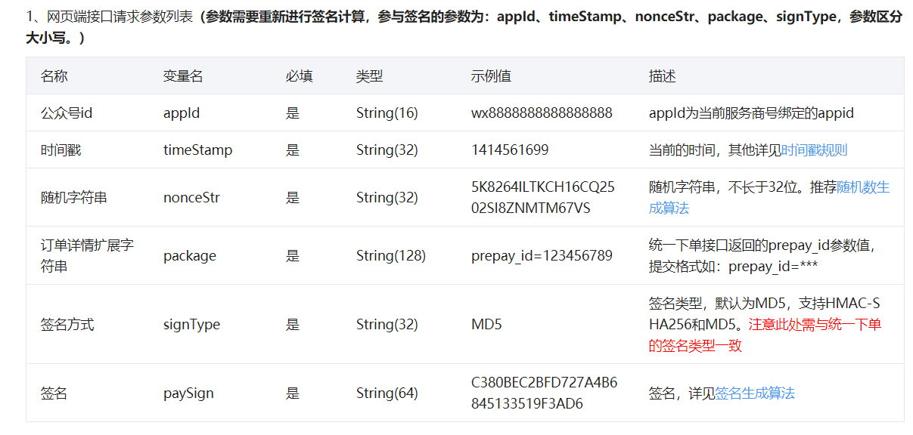

# 微信小程序业务
###### ——本文为简素言也原创手打，转载请注明出处哦——

## 一、微信授权登录全流程

1.定位授权


2.个人信息授权


3.


## 二、微信支付全流程

微信公众号服务号、公众号商城、包括小程序，都是用的JSAPI支付方式

[JSAPI官方文档](https://pay.weixin.qq.com/wiki/doc/apiv3/apis/chapter3_1_4.shtml)


#### 1.开发前准备

##### （1）在[ 微信商户平台 ](https://pay.weixin.qq.com/index.php/core/home/login?return_url=%2F)开通微信商户（该步骤较为麻烦）

获取商户号MCH_ID和设置商户API密钥，申请API证书

如果需要退款，还需要设置APIv3密钥

##### （2）微信公众平台，小程序提交认证

需填写各种信息，认证务必选择企业类型，提供企业经营证书及社会信用码等等，需要300元费用，认证很快

##### （3）开通小程序支付功能

将小程序的appid绑定到第一步开通的商户号上


#### 2.代码实现

##### （1）JSAPI统一下单

将下单的商品信息和`openId` 发给后端，

后端 通过统一下单接口，进行第一次签名，需要的参数如下：

```js
//APPID：小程序的 AppID
//MCH_ID：商户号
//KEY：商户支付API密钥
//APPSECRET：小程序开发者密钥
```

如果在统一下单的时候，不填写sign_type为MD5,则会默认使用HMAC-SHA256加密，这个是我们要排的第一个坑。

微信后台接到统一下单参数后，会生成一个商户订单，并将预下单id（prepay_id ）返回给后端


##### （2）二次签名

后端 根据微信返回值，通过微信提供的算法，进行二次签名

[签名算法](https://pay.weixin.qq.com/wiki/doc/api/wxa/wxa_api.php?chapter=4_3)

将生成的二次签名和其他参数返回给前端


##### （3）前端通过uni.request调起微信支付接口，代码如下

```js
// 唤起微信支付
uni.requestPayment({
  provider: "wxpay",
  appId: res.result.appId,  //小程序appid
  timeStamp: res.result.timeStamp,  //生产的时间戳
  nonceStr: res.result.nonceStr,  //生成的随机字符
  package: res.result.package,	 //prepay_id
  signType: res.result.signType,	//加密方式，与统一下单时的一致
  paySign: res.result.sign,		//二次签名，由后端基上面五个参数算出来的
  success: (res) => {
    console.log("支付成功", res);
    console.log("success:" + JSON.stringify(res));
    uni.showToast({
      title: "支付成功",
      duration: 3000,
      icon: "none",
    });
    setTimeout(function () {
      uni.switchTab({
        url: "xxx",
      });
    }, 1500);
  },
  fail: (err) => {
    uni.showModal({
      content: "支付失败,原因为:\n " + err.errMsg,
      showCancel: false,
    });
    console.log("fail:" + JSON.stringify(err));
  },
});
```

##### （4）遇到的报错坑

**调用支付JSAPI缺少参数: total_fee**  ==> 

说明一定是第三步里提交的参数有问题，特别注意<u>**package**</u>参数，要以 “prepay_id=xxxxxxxxxx” 的形式发送

或者是参数的大小写问题

**支付验证签名失败**  ==>

这是签名的问题，通常是第二次生成的签名不对，可以用官方的校验工具检查一下[签名校验在线工具](https://pay.weixin.qq.com/wiki/doc/api/jsapi.php?chapter=20_1)

二次签名方式一定要与统一下单接口使用的一致，比如均为MD5

注意二次签名的**变量名的大小写**为小驼峰型，与下面的文档保持一致，否则生成的paySign不对



[网上参考教程](https://blog.csdn.net/weixin_30684743/article/details/97202700)

##### （5）其他未尝试的办法

uniapp提供了一种封装好的unipay插件模板，只需要将小程序的 AppID，商户号，商户密钥等等参数传入，

通过云函数，unipay.initWeixin会帮助你生成最终提供给前端的参数

同理，小程序云开发也提供了同种功能，但是因为云开发需要付费，未曾尝试过。。。

## 三、动态计算显示高度

##### 1.获取手机型号

```js
uni.getsystemInfo(){}
```
##### 2.获取节点高度

```js
//获取节点信息
uni.createSelectorQuery()
    .in(this)
    .select("#one")
//根据节点高度与页面滚动距离scrollTop得到所需滑动的距离
    .boundingClientRect(data => {
        uni.pageScrollTo({
            duration:0,
            scrollTop: that.scrollTop + data.top-44
        });   
}).exec(
```


## 四、scroll吸附贴顶效果

#### 方法1. 监听`onPageScroll`事件，滚动到指定位置添加fixed样式

在Vue中，监听滚动事件，打印当前的`scrollTop`
首先，在mounted钩子中给window添加一个滚动滚动监听事件，

```vue
mounted () {
  window.addEventListener('scroll', this.handleScroll)
},
```

然后在方法中，添加这个`handleScroll`方法
监听元素到顶部的距离 并判断滚动的距离如果大于了元素到顶部的距离时，设置`searchBar`为true,否则就是false

```js
handleScroll () {
  var scrollTop = window.pageYOffset || document.documentElement.scrollTop || document.body.scrollTop
  var offsetTop = document.querySelector('#searchBar').offsetTop
  if (scrollTop > offsetTop) {
    this.searchBarFixed = true
  } else {
    this.searchBarFixed = false
  }
},
```

先写一个该元素固定到顶部的样式，`isFixed`
然后将需要固定的元素的class与`searchBar`进行绑定，如果`searchBar`为true时，就应用这个`isFixed`样式

```js
<view class="searchBar" id="searchBar">
```

注意，如果离开该页面需要移除这个监听的事件，不然会报错。

```js
destroyed () {
  window.removeEventListener('scroll', this.handleScroll)
},
```

存在问题：获取指定位置错误，因为上面都是图片，在图片未加载出来时获取高度， 高度值不对，解决办法就是在`imgae`上加`bindload`事件，在图片加载加载完成之后再获取高度； `onPageScroll`事件会有延迟，导致最终效果会出现卡顿

------

#### 方法2. 通过`position:sticky`

该元素并不脱离文档流，仍然保留元素原来在文档流中的位置；
当元素在容器中被滚动超过指定的偏移值时，元素就会固定到容器的指定位置，也就是说如果元素设置设置`top:50px`那么在sticky元素滚动到距离相对定位元素的顶部`50px`时固定，不再向上移动；
元素固定的相对偏移是相对于离他最近的具有滚动框的祖先元素，如果祖先元素都没有滚动框，那么就是相对于`viewport`来计算元素的偏移量

**tip：需要考虑父元素的高度的情况，sticky元素在到达父元素的底部时，则不会再发生定位，如果父元素并没有比sticky元素高，那么sticky元素一开始就到达了底部，就不会有定位的效果，当元素滚动到父元素的底部时sticky属性失效，如果父元素的overflow属性不是默认的visible，那么sticky属性不会生效**

兼容性不是很好，只支持`FireFox`和`Safari`，移动端


## 五、小程序生成海报图片并保存至本地

这里的痛点在于，uniapp和小程序不能直接操作DOM元素，所以一开始想使用 html2canvas ，不能实现

尝试其他方法：

#### 方法1.  使用原生canvas API直接绘制图片（最原始的方法）

但即使最原始的方法，依旧存在一些踩坑，譬如微信小程序官方在2.9.0开始支持了一个canvas 2D的新API，之前的API不再进行维护，因此之后使用canvas的项目，都建议使用canvas 2D来绘制

canvas 常用api和 canvas 2D用法 [跳转这里](../css/canvas)

那么canvas2D 有哪些变化呢

- 全面支持源生H5 JS的写法，迁移H5代码更容易，学习成本更低

- 性能上的优化和提升，复杂动画上帧数明显
- BUG修复，以及一些不支持的条件完善

#### 方法2.  使用插件

较为可行的插件有painter

小程序原生内置扩展组件，[ wxml-to-canvas ](https://developers.weixin.qq.com/miniprogram/dev/extended/component-plus/wxml-to-canvas.html)

但是由于uniapp打包后生成的node_modules和项目原来的node_modules不是一个东西，所以使用wxml-to-canvas需要另外的办法

除此之外还有uni版本的 html-to-canvas插件，请自行搜索~