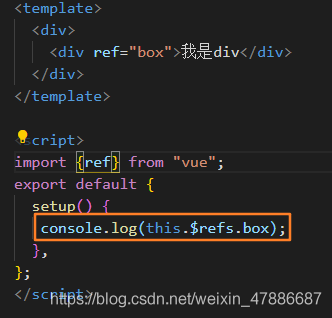

# Vue3

## 一、composition API

想在你的Vue组件之间共享代码？如果你熟悉**Vue 2** 则可能知道使用mixin，但是新的**Composition API** 提供了更好的解决方案。

### 回顾Mixins功能

让我们快速回顾一下mixins模式，因为对于下一部分我们将要讲到的内容，请务必将其放在首位。

通常，Vue组件是由一个JavaScript对象定义的，它具有表示我们所需功能的各种属性——诸如 `data`，`methods`，`computed` 等。

```js
// MyComponent.js
export default {
  data: () => ({
    myDataProperty: null
  }),
  methods: {
    myMethod () { ... }
  }
  // ...
}
```

当我们想在组件之间共享相同的属性时，可以将公共属性提取到一个单独的模块中：

```js
// MyMixin.js
export default {
  data: () => ({
    mySharedDataProperty: null
  }),
  methods: {
    mySharedMethod () { ... }
  }
}
```

现在，我们可以通过将其分配给 `mixin` config属性将其添加到任何使用的组件中。在运行时，Vue会将组件的属性与任何添加的mixin合并。

```js
// ConsumingComponent.js
import MyMixin from "./MyMixin.js";

export default {
  mixins: [MyMixin],
  data: () => ({
    myLocalDataProperty: null
  }),
  methods: {
    myLocalMethod () { ... }
  }
}
```

对于这个特定的例子，在运行时使用的组件定义应该是这样的：

```js
export default {
  data: () => ({
    mySharedDataProperty: null
    myLocalDataProperty: null
  }),
  methods: {
    mySharedMethod () { ... },
    myLocalMethod () { ... }
  }
}
```

##### 命名冲突

我们看到了mixin模式如何在运行时合并两个对象。如果他们两个都共享同名属性，会发生冲突

##### 隐式依赖

mixin和使用它的组件之间没有层次关系，如果我们以后想重构一个组件，改变了mixin需要的变量的名称，可能会发生错误

### 快速入门Composition API

Composition API的主要思想是，我们将它们定义为从新的 `setup` 函数返回的JavaScript变量，而不是将组件的功能（例如state、method、computed等）定义为对象属性。

以这个经典的Vue 2组件为例，它定义了一个“计数器”功能：

```js
//Counter.vue
export default {
  data: () => ({
    count: 0
  }),
  methods: {
    increment() {
      this.count++;
    }
  },
  computed: {
    double () {
      return this.count * 2;
    }
  }
}
```

下面是使用Composition API定义的完全相同的组件。

```js
// Counter.vue
import { ref, computed } from "vue";

export default {
  setup() {
    const count = ref(0);
    const double = computed(() => count * 2)
    function increment() {
      count.value++;
    }
    return {
      count,
      double,
      increment
    }
  }
}
```

首先会注意到，我们导入了 `ref` 函数，该函数允许我们定义一个响应式变量，其作用与 `data` 变量几乎相同。计算属性的情况与此相同。

`increment` 方法不是被动的，所以它可以被声明为一个普通的JavaScript函数。注意，我们需要更改子属性 `count` 的 `value` 才能更改响应式变量。这是因为使用 `ref` 创建的响应式变量必须是对象，以便在传递时保持其响应式。

定义完这些功能后，我们将从 `setup` 函数中将其返回。上面两个组件之间的功能没有区别，我们所做的只是使用替代API。

### 代码提取

Composition API的第一个明显优点是提取逻辑很容易。

让我们使用Composition API重构上面定义的组件，以使我们定义的功能位于JavaScript模块 `useCounter` 中（在特性描述前面加上“use”是一种Composition API命名约定。）。

```js
//useCounter.js
import { ref, computed } from "vue";

export default function () {
  const count = ref(0);
  const double = computed(() => count * 2)
  function increment() {
    count.value++;
  }
  return {
    count,
    double,
    increment
  }
}
```

### 代码重用

要在组件中使用该函数，我们只需将模块导入组件文件并调用它（注意导入是一个函数）。这将返回我们定义的变量，随后我们可以从 `setup` 函数中返回它们。

```js
// MyComponent.js
import useCounter from "./useCounter.js";

export default {
  setup() {
    const { count, double, increment } = useCounter();
    return {
      count,
      double,
      increment
    }
  }
}
```

乍一看，这似乎有点冗长而毫无意义，但让我们来看看这种模式如何克服了前面讨论的mixins问题。

命名冲突解决了，隐式依赖也解决了

合成函数(Composition Function)还可以调用消费组件中定义的局部变量。不过，不同之处在于，现在必须将此变量显式传递给合成函数。

```js
import useCompFunction from "./useCompFunction";

export default {
  setup () {
    // 某个局部值的合成函数需要用到
    const myLocalVal = ref(0);

    // 它必须作为参数显式地传递
    const { ... } = useCompFunction(myLocalVal);
  }
}
```

### 总结

mixin模式表面上看起来很安全。然而，通过合并对象来共享代码，由于它给代码增加了脆弱性，并且掩盖了推理功能的能力，因此成为一种反模式。

Composition API最聪明的部分是，它允许Vue依靠原生JavaScript中内置的保障措施来共享代码，比如将变量传递给函数和模块系统。

**这是否意味着Composition API在各方面都比Vue的经典API优越？不是的。在大多数情况下，你坚持使用经典API是没有问题的。但是，如果你打算重用代码，Composition API无疑是优越的。**

[参考原文](https://zhuanlan.zhihu.com/p/135444167)


---

## 二、setup 的使用

#### 1.通过 ref 新建响应式数据

##### （1）什么是 ref?

ref 和 reactive 一样,也是用来实现响应式数据的方法
由于 reactive 必须传递一个对象,所以在实际开发中如果只是想让某个变量实现响应式的时候回非常麻烦
所以 Vue3 提供了 ref 方法实现简单值得监听

##### （2）.ref 本质

ref 底层其实还是 reactive,所以当运行时系统会自动根据传入的 ref 转换成 reactive.

##### （3）ref 注意点

在 vue 中使用 ref 的值不用通过 value 获取
在 js 中使用 ref 的值必须通过 value 获取


##### （4）ref 获取元素

在 vue2 中我们可以通过给元素添加 ref=‘xxx’,然后在代码中通过 refs.xxx 的方式来获取元素,在 vue3 中也可以通过 ref 来获取元素.
但不是像以下这种熟悉的方式,因为在 vue3 中没有$和 refs 这些东西.

###### 错误示范



###### 正确写法


---

#### 2.通过 props 接收传递的数据

---

## 三、深入 vue3 响应式原理


