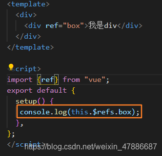
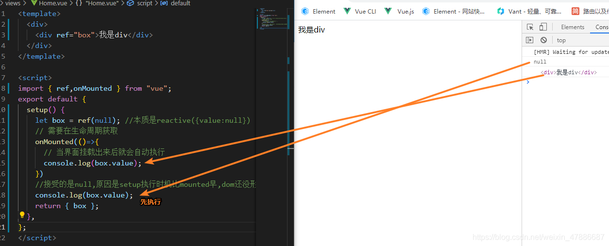

# Vue3

> 前置知识： [Proxy](../js/proxy)
>
> 创建vue3项目的两种方式：
> 1.vue-cli（版本4.5.0以上） `vue create xxx`
> 2.通过vite创建  `npm init vite-app xxx`  `yarn create vite-app xxx`

## 一、基础

```js
import {creatApp} from 'vue' 		//引入的不再是Vue构造函数，引入的是一个名为creatApp的工厂函数
creatApp(App).mount('#app')			//挂载
```

### 1.ref、reactive


### 2.composition API

想在你的Vue组件之间共享代码？如果你熟悉**Vue 2** 则可能知道使用mixin，但是新的**Composition API** 提供了更好的解决方案。

#### 回顾Mixins功能

让我们快速回顾一下mixins模式，因为对于下一部分我们将要讲到的内容，请务必将其放在首位。

通常，Vue组件是由一个JavaScript对象定义的，它具有表示我们所需功能的各种属性——诸如 `data`，`methods`，`computed` 等。

```js
// MyComponent.js
export default {
  data: () => ({
    myDataProperty: null
  }),
  methods: {
    myMethod () { ... }
  }
  // ...
}
```

当我们想在组件之间共享相同的属性时，可以将公共属性提取到一个单独的模块中：

```js
// MyMixin.js
export default {
  data: () => ({
    mySharedDataProperty: null
  }),
  methods: {
    mySharedMethod () { ... }
  }
}
```

现在，我们可以通过将其分配给 `mixin` config属性将其添加到任何使用的组件中。在运行时，Vue会将组件的属性与任何添加的mixin合并。

```js
// ConsumingComponent.js
import MyMixin from "./MyMixin.js";

export default {
  mixins: [MyMixin],
  data: () => ({
    myLocalDataProperty: null
  }),
  methods: {
    myLocalMethod () { ... }
  }
}
```

对于这个特定的例子，在运行时使用的组件定义应该是这样的：

```js
export default {
  data: () => ({
    mySharedDataProperty: null
    myLocalDataProperty: null
  }),
  methods: {
    mySharedMethod () { ... },
    myLocalMethod () { ... }
  }
}
```

##### 命名冲突

我们看到了mixin模式如何在运行时合并两个对象。如果他们两个都共享同名属性，会发生冲突

##### 隐式依赖

mixin和使用它的组件之间没有层次关系，如果我们以后想重构一个组件，改变了mixin需要的变量的名称，可能会发生错误

#### 快速入门Composition API

Composition API的主要思想是，我们将它们定义为从新的 `setup` 函数返回的JavaScript变量，而不是将组件的功能（例如state、method、computed等）定义为对象属性。

以这个经典的Vue 2组件为例，它定义了一个“计数器”功能：

```js
//Counter.vue
export default {
  data: () => ({
    count: 0
  }),
  methods: {
    increment() {
      this.count++;
    }
  },
  computed: {
    double () {
      return this.count * 2;
    }
  }
}
```

下面是使用Composition API定义的完全相同的组件。

```js
// Counter.vue
import { ref, computed } from "vue";

export default {
  setup() {
    const count = ref(0);
    const double = computed(() => count * 2)
    function increment() {
      count.value++;
    }
    return {
      count,
      double,
      increment
    }
  }
}
```

首先会注意到，我们导入了 `ref` 函数，该函数允许我们定义一个响应式变量，其作用与 `data` 变量几乎相同。计算属性的情况与此相同。

`increment` 方法不是被动的，所以它可以被声明为一个普通的JavaScript函数。注意，我们需要更改子属性 `count` 的 `value` 才能更改响应式变量。这是因为使用 `ref` 创建的响应式变量必须是对象，以便在传递时保持其响应式。

定义完这些功能后，我们将从 `setup` 函数中将其返回。上面两个组件之间的功能没有区别，我们所做的只是使用替代API。

#### 代码提取

Composition API的第一个明显优点是提取逻辑很容易。

让我们使用Composition API重构上面定义的组件，以使我们定义的功能位于JavaScript模块 `useCounter` 中（在特性描述前面加上“use”是一种Composition API命名约定。）。

```js
//useCounter.js
import { ref, computed } from "vue";

export default function () {
  const count = ref(0);
  const double = computed(() => count * 2)
  function increment() {
    count.value++;
  }
  return {
    count,
    double,
    increment
  }
}
```

#### 代码重用

要在组件中使用该函数，我们只需将模块导入组件文件并调用它（注意导入是一个函数）。这将返回我们定义的变量，随后我们可以从 `setup` 函数中返回它们。

```js
// MyComponent.js
import useCounter from "./useCounter.js";

export default {
  setup() {
    const { count, double, increment } = useCounter();
    return {
      count,
      double,
      increment
    }
  }
}
```

乍一看，这似乎有点冗长而毫无意义，但让我们来看看这种模式如何克服了前面讨论的mixins问题。

命名冲突解决了，隐式依赖也解决了

合成函数(Composition Function)还可以调用消费组件中定义的局部变量。不过，不同之处在于，现在必须将此变量显式传递给合成函数。

```js
import useCompFunction from "./useCompFunction";

export default {
  setup () {
    // 某个局部值的合成函数需要用到
    const myLocalVal = ref(0);

    // 它必须作为参数显式地传递
    const { ... } = useCompFunction(myLocalVal);
  }
}
```

#### 总结

mixin模式表面上看起来很安全。然而，通过合并对象来共享代码，由于它给代码增加了脆弱性，并且掩盖了推理功能的能力，因此成为一种反模式。

Composition API最聪明的部分是，它允许Vue依靠原生JavaScript中内置的保障措施来共享代码，比如将变量传递给函数和模块系统。

**这是否意味着Composition API在各方面都比Vue的经典API优越？不是的。在大多数情况下，你坚持使用经典API是没有问题的。但是，如果你打算重用代码，Composition API无疑是优越的。**

[参考原文](https://zhuanlan.zhihu.com/p/135444167)


### 3.setup

执行时间：在`beforeCreate`之前执行一次，this是undefined

接受两个参数， props，context

props值为对象，包含组件外部传递过来，且组件内部声明接收的属性

context是一个上下文对象，有 `attrs` 、 `emit` 、`slots` 属性

attrs：值为对象，包含组件外部传递过来，但未在props配置中声明的属性，相当于this.$attrs

emit：为分发自定义事件的函数，相当于 this.$emit

slots：为收到的插槽内容，相当于this.$slots

```html
<script>
export default{
  props:['msg','school']	//声明接受的props
  setup(props,context){
	//setup接受第一个参数props
  //第二个参数context，执行上下文对象
	}
}  
</script>
```


### 4.computed

与vue2差不多一致，两种写法(一种简写仅读，一种传入配置对象声明get和set）

唯一区别，需要引入，以函数形式使用


### 5.watch

与vue2中watch配置功能基本一致

情况一：监视ref所定义的一个响应式数据

```js
watch(sum,(newValue,oldValue)=>{
	console.log('sum变了',newValue,oldValue)
},{imediate:true})
//watch函数第一个参数，监视目标，第二个参数 回调函数，第三个参数 是否立即调用等
```

情况二：监视ref所定义的多个响应式数据

```js
watch([sum,msg],(newValue,oldValue)=>{
	console.log('sum或msg变了',newValue,oldValue)
},{imediate:true})
//以数组的形式传入，同时回调函数返回的新值旧值也是 数组形式
```

情况三：监视reactive所定义的一个响应式对象数据的全部属性

存在问题1：此处无法正确获取oldValue

存在问题2：强制开启深度监视（deep配置无效）

（个人理解：因为引用的是proxy代理的源对象，所以deep配置无效）

```js
watch(person,(newValue,oldValue)=>{
	console.log('person变了',newValue,oldValue)
},{imediate:true})
```

情况四：监视reactive所定义的一个响应式对象数据的一个属性

此时可以正确获得oldValue

```js
//A watch source can only be a getter/effect function,a ref,a reactive object,or an array of these types.
//此时第一个参数，必须要以函数返回值的形式返回
watch(()=>person.age,(newValue,oldValue)=>{
  console.log('person的age变化了',newValue,oldValue)
})
```

情况五：监视reactive所定义的一个响应式对象数据的多个属性

```js
watch([()=>person.name,()=>person.age],(newValue,oldValue)=>{
  console.log('person的age变化了',newValue,oldValue)
})
```

特殊情况：当监视的是 reactive定义的一个响应式对象 中的一个属性，同时这个属性是一个有多层嵌套的对象

此时必须开启deep：true，才能监视到

```js
watch(()=>person.job,(newValue,oldValue)=>{
  console.log('person的age变化了',newValue,oldValue)
},{deep:true})//监视的是 reactive定义的一个响应式对象中的某个属性，所以deep配置有效
```

（个人理解：因为这个对象不是被proxy代理的源对象，而是引用的另一个普通对象，所以需要开启深度监听。proxy代理的源对象不需要开启深度监听）

```js
//watch 既要指明监听的属性，也要指明监听的回调
watch(()=>person.job,(newValue,oldValue)=>{
  console.log(newValue,oldValue)
},{deep:true})	 //由于监视的是reactive定义的对象，deep配置有效
```

```js
//watchEffect 不用指明监视哪个属性，监视的回调中用到哪个属性就监视那个属性
//有点像computed，但是computed更注重计算出来的值(回调函数的返回值)
//而watchEffect更注重过程(回调函数的函数体)，不用写返回值
watchEffect(()=>{
  const x1 = sum.value
  const x2 = person.age
  console.log('执行了')
})
```


### 6.生命周期

> 除去 `beforeCreate` 和 `created` 之外，在我们的 `setup` 方法中，有9个旧的生命周期钩子，我们可以在`setup` 方法中访问
>
> onBeforeMount、onMounted、onBeforeUpdate、onUpdated、onBeforeUnmount、onUnmounted、onActivated、onDeactivated、onErrorCaptured


#### 使用方法

```js
import {onMounted, ref} from 'vue'
export default function useMouse() {
	let x = ref(0)
	let y = ref(0)
//onMounted中接受一个回调函数
	onMounted(() => {
		window.addEventListener('mousemove', e => {
			x.value = e.pageX
			y.value = e.pageY
		})
	})
	return {x, y};//x,y可以在组件中使用
}
```


#### 从Vue2转换到Vue3

这个方便的Vue2到Vue3的生命周期映射直接来自于Vue3 Composition API 文档，我认为这是一种最有用的方式来查看事情将如何变化，以及我们如何使用它们。

- beforeCreate -> use setup()
- created -> use setup()
- beforeMount -> onBeforeMount
- mounted -> onMounted
- beforeUpdate -> onBeforeUpdate
- updated -> onUpdated
- beforeDestroy -> onBeforeUnmount
- destroyed -> onUnmounted
- errorCaptured -> onErrorCaptured

#### 新的调试钩子函数

们还可以在Vue3中使用两个全新的钩子函数来进行调试。他们是：

- onRenderTracked
- onRenderTriggered

这两个事件都带有一个**DebuggerEvent**，它使我们能够知道是什么导致了Vue实例中的重新渲染。

```js
export default {
  onRenderTriggered(e) {
    debugger
    // 检查哪个依赖项导致组件重新呈现
  }
}
```


### 7.toRef

```js
//创建一个ref对象，其value指向另一个对象的某个属性，可以将响应式对象中的某个属性单独提供给外部使用
const name = toRef(person,'name')
//**为什么不直接 ref(person.name)? 因为这样会新建一个ref数据，跟之前的对象无关联
//toRefs 批量创建多个ref对象
return{
  ...toRefs(person)
}
```


### 8.shallowRef

shallowRef、shallowReactive

```

```


## 二、自定义hook

```
//函数复用
```

### 使用vuex

> 先引用 vuex   import { useStore } from 'vuex'
>
> 然后setup里面  const store = useStore()
>
>
> 然后就可以把 store 当成$store 那样使用了，可以用watch，也可以用 computed。
>
> 最后vue3的vuex的state，可以使用 reactive ，这样就不用 computed 了。如果想只读的话，可以加上 readonly

```js
//组件中
import { watch } from 'vue'
import { useStore } from 'vuex'
export default {
  setup (props, context) {
    const $store = useStore()
    watch(() => $store.state.demo.count, (val, old) => {
      console.log(val, old)
    })
    return {}
  }
}
```

```js
// use this file at setup function

import { watch } from 'vue'
import { useStore } from '@/store';
import { useRouter } from 'vue-router';
import { get } from 'lodash-es';

/**
 * Auth Guard 拦截
 */
export default function useAuth() {
    const store = useStore()
    const router = useRouter();

    if (!get(router.currentRoute.value.meta, 'auth')) {
        return {}
    }

    // 监听是否是 401 请求
    watch(() => store.state.poppy.is401,
        (newValue, oldValue) => {
            if (newValue && !oldValue) {
                router.push({
                    name: 'user.login',
                    query: {
                        go: router.currentRoute.value.path
                    }
                }).then()
            }
        }, {
            deep: true
        }
    );
}
```


```js
// 可以看出与vue2的写法有些区别，但是用法一样
// 但是需要注意的是如果在创建项目时没有安装vuex 则需要自己安装 
// 安装命令是 npm install vuex@next --save 
// 这里需要注意命令的不同,安装的版本就不同
import { createStore } from 'vuex'

export default createStore({
    state: { // 用来写要存储的状态（数据）
        name: '张三',
        age: 16
    },
    getters: { // 相当于vue中的计算属性
        changeAge(state) {
            return state.age + '岁'
        } 
    },
    mutations: { // 修改state数据的唯一方法就是提交mutation
        changeName(state, value) {
            state.name = value
        },

        changeProducts(state, value=[]) {
            state.products = value
        }
    },
    actions: { // 异步处理数据的方法 通过提交mutation修改数据 不建议直接修改 这里直接修改也可以 但是当前情况下框架不完善 所以不建议直接修改
        getProducts({commit}) {
        setTimeout(() => {
            commit('changeProducts', [{name: '这是一个商品'}])
        }, 1000)
        }
    },
    modules: { // 模块化方法
    },
    plugins: [] // 插件使用的位置
})
```

```vue
<template>
  <div class="home">
    {{name}} - {{age}}
    <button @click="changeName('李四')">修改名字</button>
    <button @click="getProducts">点击获取商品数据</button>
    <ul>
      <li v-for="(item, i) in products" :key="i">{{item.name}}</li>
    </ul>
  </div>
</template>
<script>
// defineComponent 定义一个组件的方法 返回值是传递给函数的对象 也可以接收一个函数作为参数
// 函数的名将可以作为组件的名字使用 该方法用在ts代码中会更有用，因为ts中可以注明配置项的参数类型
// 在js中使用意义不是很大， 但是我们这里尽量尊重vue3
// computed 计算属性 返回一个ref类型的数据 ref是vue3用来声明具有相应式的基本数据类型的方法
import { defineComponent, computed } from 'vue'
// useStore 可以将store中的数据和方法获取到的方法
import { useStore } from 'vuex';
export default defineComponent({
  // vue3的组合api 运行在beforeCreate之前 为了方式this使用错误 setup中直接将this的值设置成了undefined 所以在setup中没有this
  setup() {
    let store = useStore()
    // console.log(store.state);
    // 在setup中定义的方法和数据如果需要在页面中使用 则需要先将数据或者方法返回
    return {
      name: computed(() => store.state.name),
      age: computed(() => store.getters.changeAge),
      changeName: (name) => store.commit('changeName', name), // 使用mutation方法的函数
      getProducts: () => store.dispatch('getProducts'), // 调用actions函数的方法
      products: computed(() => store.state.products)
    }
  }
})
</script>
```


---

## 三、setup 的使用

#### 1.通过 ref 新建响应式数据

##### （1）什么是 ref?

ref 和 reactive 一样,也是用来实现响应式数据的方法
由于 reactive 必须传递一个对象,所以在实际开发中如果只是想让某个变量实现响应式的时候回非常麻烦
所以 Vue3 提供了 ref 方法实现简单值得监听

##### （2）.ref 本质

ref 底层其实还是 reactive,所以当运行时系统会自动根据传入的 ref 转换成 reactive.

##### （3）ref 注意点

在 vue 中使用 ref 的值不用通过 value 获取
在 js 中使用 ref 的值必须通过 value 获取


##### （4）ref 获取元素

在 vue2 中我们可以通过给元素添加 ref=‘xxx’,然后在代码中通过 refs.xxx 的方式来获取元素,在 vue3 中也可以通过 ref 来获取元素.
但不是像以下这种熟悉的方式,因为在 vue3 中没有$和 refs 这些东西.

###### 错误示范



###### 正确写法



---

#### 2.通过 props 接收传递的数据


## 四、vue3.0中的路由及路由守卫

### 1、部分API进行了删除或修改

- tag是我们可以改变标签的属性进行了删除，event也删除了

- exact也进行了删除

- 全局的404不再使用*键了，文档有可查看

- 那么有的小伙伴说都删除了，我们应该使用什么呢？那肯定是有的，想了解的朋友可以去官方看看文档，我看了下，有一个新增的API就是v-slot，具体怎么使用，需要稍等会，正在努力研究中

- 还有我们的组件路由守卫中的beforeRouteEnter进行了删除（我是没找到，希望看到的小伙伴可以告诉我，谢谢）

- 新增的两个API是我们经常会使用到的，很有用**useRouter,useRoute**后面会介绍到，别慌

### 2、简单使用

> 同vue2.0

```xml
<router-link to="/">首页</router-link>
<router-view></router-view>//要在哪里显示路由页面，就在哪里进行标签的书写
```

### 3、router.js路由文件

```jsx
import { createRouter, createWebHashHistory } from "vue-router";
const routes = [
          {
              path:"/",
              name:"home",
              component:()=>import("../views/home.vue")
          }
        ]
const router = createRouter({
  history: createWebHashHistory(),
  routes
});
export default router;
//在main.js中进行引入，并进行挂载注册到全局上
```

### 4、query和params传参

- params传参要在路由的js文件中进行配置

```csharp
    const routes = [
        {
            path:'/home/:id',//这个id就是我们要使用params进行动态传递的参数
            name:home,
            component:Home
        }
    ]
    //! 在我们的页面中直接进行写就可以了
    <router-link to="/home/111">点击跳转到home页面并传参</router-link>
    //接受的时候
    vue2.0中this.$route.params.id
    vue3.0中import { useRoute } from 'vue-router'
    const route = useRoute()
    console.log(route.params.id);//111
```

- query传参可以直接在标签上写

```kotlin
    <router-link to="/test?id=999">test</router-link>
    //接受的时候
    vue2.0中this.$route.query.id
    vue3.0中import { useRoute } from 'vue-router'
    const route = useRoute()
    console.log(route.query.id);//999
```

- 编程式导航的传参，params使用name,query使用path

```jsx
    //vue3.0中
    import { useRouter } from 'vue-router'
    const route = useRouter()
        // ! query编程式导航传参
            route.push({
                path:"/lianxi",
                query:{
                    id:666
                }
            });
 //! params编程式导航传参
  route.push({
     name:'lianxi',
         params:{
          id:666
         }
     });
 //接受参数的方法跟上面的一样
 //vue3.0中
 import { useRoute } from 'vue-router'
 const route = useRoute()
 console.log(route.query.id);//999
```

- **注意：**上面的编程式导航用到了上面提到的两个API，一个是我们需要进行设置的，一个是我们用来读取的

```kotlin
就像vue2.0中的this.$router.push()和this.$route.query.id等是不是很像呢
```

### 5、replaceApi

```jsx
<router-link to="/home" replace></router-link>

route.push({
    path:"/home",
    replace:true
})
```

### 6、命名视图

```jsx
<router-view name="LeftSidebar"></router-view>
<router-view></router-view>
<router-view name="RightSidebar"></router-view>
//在路由的设置js文件中进行配置下
 const route = [
     {
         path:"/home",
         name:"home",
         components:{
             default:Home,//默认显示home页面
             LeftSidebar:LeftSidebar,//显示左侧页面
             RightSidebar//显示右侧页面
         }
     }
 ]
```

### 7、重定向和别名（可以有多个别名）

```csharp
    route = [
        {
            path:"/",
            redirect:"/home"//重定向
        },
        {
            path:"/test",
            name:"test",
            component:Test,
            alias:"/aa",//别名使用时直接使用aa就可以了
            alias:["/aa","/cc"],//此时用哪个都可以，这是多个别名
        }
    ]
    <router-link to="/aa"></router-link>
```

### 8、使用props获取路由传递的参数

```csharp
    //在路由配置的组件中，我们进行配置
    const routes = [
        {
            path:"/aa/:id",
            name:"aa",
            component:Aa,
            props:true//要加这个
        }
    ]
    //在页面中
    <router-link to= "/aa/666">点击跳转并传参</router-link>
    //在aa的页面中
    props:['id'],
    <template>
        {{id}}//直接就能获取到我们传递过来的参数
    </template>
```

### 9、多个命名视图的时候，props也要写多个

```cpp
    const routes = [
        {
            path:"/use/:id",
            name:"use",
            components:{
                default:Use,
                slide:Slide,
                rightSlide
            },
            props:{
                default:true,
                slide:false,
                rightSlide:false
            }
        }
    ]
```

### 10、全局路由守卫

> （vue-router4.0中将next取消了，可写可不写，return false取消导航，undefined或者是return true验证导航通过）

- router.beforeEach((to,from)=>{}),next是可选参数，可写可不写，return false是取消导航，如果返回值为true或者是undefined意味着通过验证

- router.afterEach((to,from)=>{})

- console.log(to.fullPath);//1可以直接将当前的URL路径及传参打印出来

### 11、路由独享

```jsx
    const routes = [
        {
            path:"/home",
            name:"home",
            component:Home,
            beforeEnter:(to,from) =>{
                //to是当用户点击进入当前页面的时候,我们可以进行一些拦截设置
                //from当来自其他页面进入当前页面的时候，我们也可以进行拦截提示用户
                alert('我是路由独享守卫！！！')
            }
        }
    ]
```

### 12、组件中的路由守卫

```jsx
import { onBeforeRouteLeave, onBeforeRouteUpdate } from 'vue-router';
        onBeforeRouteUpdate((to,from)=>{//当前组件路由改变后，进行触发
            console.log(to);
        })
        onBeforeRouteLeave((to,from)=>{//离开当前的组件，触发
            alert('我离开啦')
        })
```

### 13、新增的一些方法

- **addRoute**：新添加路由页面(也可以添加子页面路由)

- 添加一级路由

```jsx
// todo 这是新添加的路由页面，如果有重复的属性，会先删除前面的，添加后面的路由页面
router.addRoute({
  path:"/router",
  name:"router",
  component:()=>import('../views/router.vue')
})
```

- 添加二级路由

```csharp
// 1 添加子路由，第一个参数是父路由的name名，后面是子路由的数据
router.addRoute({ name: 'admin', path: '/admin', component: Admin })//1 父路由
router.addRoute('admin', { path: 'settings', component: AdminSettings })//1 子路由
```

- 如果添加的路由有点问题，可以将下面的这句代码加上看看

```csharp
// * 如果上面添加的路由页面没有变化，那么就添加这行代码
router.replace(router.currentRoute.value.fullPath)//替换当前路由页面的路由
```

- **removeRoute**：删除路由

```bash
router.removeRoute('router');
```


## 五、深入Vue3源码

### 前置知识

- [Proxy](../js/proxy)
- [函数式编程]()
- Set、Map、WeakSet、WeakMap
- Typescript


### Proxy和defineProperty对比

一个优秀的开源框架本身就是一个不断打碎重朔的过程，上面做了些许铺垫，现在我们简要总结一下

- `Proxy` 作为新标准将受到浏览器厂商重点持续的性能优化
- `Proxy` 能观察的类型比 `defineProperty` 更丰富
- `Proxy` 不兼容IE，也没有 `polyfill`, `defineProperty` 能支持到IE9
- **`Object.definedProperty` 是劫持对象的属性，新增元素需要再次 `definedProperty`**。而 `Proxy` 劫持的是整个对象，不需要做特殊处理
- 使用 `defineProperty` 时，我们修改原来的 `obj` 对象就可以触发拦截，而使用 `proxy`，就必须修改代理对象，即 `Proxy` 的实例才可以触发拦截


### 源码目录

进入源码目录执行 `tree -aI ".git*|.vscode" -C -L 1` 获取整个目录

```js
├── .circleci // CI 配置目录
├── .ls-lint.yml // 文件命名规范
├── .prettierrc // 代码格式化 prettier 的配置文件
├── CHANGELOG.md  // 更新日志
├── LICENSE
├── README.md
├── api-extractor.json // TypeScript 的API提取和分析工具
├── jest.config.js  //  测试框架 jest 的配置文件
├── node_modules
├── package-lock.json
├── package.json
├── packages // Vue源代码目录
├── rollup.config.js  // 模块打包器 rollup 的配置文件
├── scripts
├── test-dts // TypeScript 声明文件
├── tsconfig.json // TypeScript 配置文件
└── yarn.lock
```

上面用到的一些工具大家有兴趣可以自行查阅相关资料，在这里我们只重点关注 `package` 目录，整个结构如下

```js
.
├── compiler-core // 顾名思义，核心中的核心，抽象语法树和渲染桥接实现
├── compiler-dom // Dom的实现
├── compiler-sfc // Vue单文件组件(.vue)的实现
├── compiler-ssr
├── global.d.ts
├── reactivity
├── runtime-core
├── runtime-dom
├── runtime-test
├── server-renderer // 服务端渲染实现
├── shared  // package 之间共享的工具库
├── size-check
├── template-explorer
└── vue
```

###  Runtime 跟 CompileTime

通过结构我们可以看到 `package` 中最重要的模块有5个，分别为

- compiler-core
- compiler-dom
- runtime-core
- runtime-dom
- reactivity

不难发现 `core`, `dom` 分别出现了两次，那么 `compiler` `runtime` 它们之间又有什么区别呢？

`compile time` 我们可以理解为程序编绎时，是指我们写好的源代码在被编译成为目标文件这段时间，但我们可以通俗的看成是我们写好的源代码在被转换成为最终可执行的文件这段时间，在这里可以理解为我们将`.vue`文件编绎成浏览器能识别的`.html`文件的一些工作，

`run time` 可以理解为程序运行时，即是程序被编译了之后，打开程序并运行它直到程序关闭的这段时间的系列处理

### CreateApp

> 顾名思义，CreateApp 作为 vue 的启动函数，返回一个应用实例

```js
const HelloVueApp = {
  data() {
    return {
      message: 'Hello Vue!'
    }
  }
}

Vue.createApp(HelloVueApp).mount('#hello-vue')
```


### defineComponent

> 实现方式的 defineComponent 只是返回传递给它的对象。但是，在类型方面，返回的值具有一个合成类型的构造函数，用于手动渲染函数、 TSX 和 IDE 工具支持

https://blog.csdn.net/weixin_39720860/article/details/113406363

```js
import { defineComponent } from 'vue'

const MyComponent = defineComponent({
  data() {
    return { count: 1 }
  },
  methods: {
    increment() {
      this.count++
    }
  }
})

console.log(`MyComponent:${MyComponent}`)
```

### h函数

`h` 其实代表的是 [hyperscript](https://github.com/hyperhype/hyperscript) 。它是 HTML 的一部分，表示的是超文本标记语言，当我们正在处理一个脚本的时候，在虚拟 DOM 节点中去使用它进行替换已成为一种惯例。这个定义同时也被运用到其他的框架文档中

**Hyperscript 它本身表示的是 "生成描述 HTML 结构的脚本"**

好了，了解了什么是 `h`，现在我们来看官方对他的一个定义

> 定义: 返回一个“虚拟节点” ，通常缩写为 VNode: 一个普通对象，其中包含向 Vue 描述它应该在页面上呈现哪种节点的信息，包括对任何子节点的描述。用于手动编写render

#### 语法

```js
// type only
h('div')

// type + props
h('div', {})

// type + omit props + children
// Omit props does NOT support named slots
h('div', []) // array
h('div', 'foo') // text
h('div', h('br')) // vnode
h(Component, () => {}) // default slot

// type + props + children
h('div', {}, []) // array
h('div', {}, 'foo') // text
h('div', {}, h('br')) // vnode
h(Component, {}, () => {}) // default slot
h(Component, {}, {}) // named slots

// named slots without props requires explicit `null` to avoid ambiguity
h(Component, null, {})
```

举个栗子

```js
const App = {
    render() {
      return Vue.h('h1', {}, 'Hello Vue3js.cn')
    }
}
Vue.createApp(App).mount('#app')
```

#### 都干了些啥

`h` 接收三个参数

- type 元素的类型
- propsOrChildren 数据对象, 这里主要表示(props, attrs, dom props, class 和 style)
- children 子节点

```
export function h(type: any, propsOrChildren?: any, children?: any): VNode {
  if (arguments.length === 2) {
    if (isObject(propsOrChildren) && !isArray(propsOrChildren)) {
      // single vnode without props
      if (isVNode(propsOrChildren)) {
        return createVNode(type, null, [propsOrChildren])
      }
      // props without children
      return createVNode(type, propsOrChildren)
    } else {
      // omit props
      return createVNode(type, null, propsOrChildren)
    }
  } else {
    if (isVNode(children)) {
      children = [children]
    }
    return createVNode(type, propsOrChildren, children)
  }
}
```

`_createVNode` 做的事情也很简单

```
function _createVNode(
  type: VNodeTypes | ClassComponent | typeof NULL_DYNAMIC_COMPONENT,
  props: (Data & VNodeProps) | null = null,
  children: unknown = null,
  // 更新标志
  patchFlag: number = 0,
  // 自定义属性
  dynamicProps: string[] | null = null,
  // 是否是动态节点，(v-if v-for)
  isBlockNode = false 
): VNode {
  // type必传参数
  if (!type || type === NULL_DYNAMIC_COMPONENT) {
    if (__DEV__ && !type) {
      warn(`Invalid vnode type when creating vnode: ${type}.`)
    }
    type = Comment
  }

  // Class 类型的type标准化
  // class component normalization.
  if (isFunction(type) && '__vccOpts' in type) {
    type = type.__vccOpts
  }

  // class & style normalization.
  if (props) {
    // props 如果是响应式，clone 一个副本
    if (isProxy(props) || InternalObjectKey in props) {
      props = extend({}, props)
    }
    let { class: klass, style } = props

    // 标准化class, 支持 string , array, object 三种形式
    if (klass && !isString(klass)) {
      props.class = normalizeClass(klass)
    }

    // 标准化style, 支持 array ,object 两种形式 
    if (isObject(style)) {
      // reactive state objects need to be cloned since they are likely to be
      // mutated
      if (isProxy(style) && !isArray(style)) {
        style = extend({}, style)
      }
      props.style = normalizeStyle(style)
    }
  }

  // encode the vnode type information into a bitmap
  const shapeFlag = isString(type)
    ? ShapeFlags.ELEMENT
    : __FEATURE_SUSPENSE__ && isSuspense(type)
      ? ShapeFlags.SUSPENSE
      : isTeleport(type)
        ? ShapeFlags.TELEPORT
        : isObject(type)
          ? ShapeFlags.STATEFUL_COMPONENT
          : isFunction(type)
            ? ShapeFlags.FUNCTIONAL_COMPONENT
            : 0

  if (__DEV__ && shapeFlag & ShapeFlags.STATEFUL_COMPONENT && isProxy(type)) {
    type = toRaw(type)
    warn(
      `Vue received a Component which was made a reactive object. This can ` +
        `lead to unnecessary performance overhead, and should be avoided by ` +
        `marking the component with \`markRaw\` or using \`shallowRef\` ` +
        `instead of \`ref\`.`,
      `\nComponent that was made reactive: `,
      type
    )
  }

  // 构造 VNode 模型
  const vnode: VNode = {
    __v_isVNode: true,
    __v_skip: true,
    type,
    props,
    key: props && normalizeKey(props),
    ref: props && normalizeRef(props),
    scopeId: currentScopeId,
    children: null,
    component: null,
    suspense: null,
    dirs: null,
    transition: null,
    el: null,
    anchor: null,
    target: null,
    targetAnchor: null,
    staticCount: 0,
    shapeFlag,
    patchFlag,
    dynamicProps,
    dynamicChildren: null,
    appContext: null
  }

  normalizeChildren(vnode, children)

  // presence of a patch flag indicates this node needs patching on updates.
  // component nodes also should always be patched, because even if the
  // component doesn't need to update, it needs to persist the instance on to
  // the next vnode so that it can be properly unmounted later.

  // patchFlag 标志存在表示节点需要更新，组件节点一直存在 patchFlag，因为即使不需要更新，它需要将实例持久化到下一个 vnode，以便以后可以正确卸载它
  if (
    shouldTrack > 0 &&
    !isBlockNode &&
    currentBlock &&
    // the EVENTS flag is only for hydration and if it is the only flag, the
    // vnode should not be considered dynamic due to handler caching.
    patchFlag !== PatchFlags.HYDRATE_EVENTS &&
    (patchFlag > 0 ||
      shapeFlag & ShapeFlags.SUSPENSE ||
      shapeFlag & ShapeFlags.TELEPORT ||
      shapeFlag & ShapeFlags.STATEFUL_COMPONENT ||
      shapeFlag & ShapeFlags.FUNCTIONAL_COMPONENT)
  ) {
    // 压入 VNode 栈
    currentBlock.push(vnode)
  }

  return vnode
}
```

#### 总结

到这里，`h` 函数已经全部看完了，我们现在知道 `h` 叫法的由来，其函数内部逻辑只做参数检查，真正的主角是 `_createVNode`

`_createVNode` 做的事情有

1. 标准化 `props` `class`
2. 给 `VNode` 打上编码标记
3. 创建 `VNode`
4. 标准化子节点

有的同学可能会有疑问🤔️，`VNode` 最后是怎么转换成真实的 `DOM` 呢?


### 响应式核心

Vue3中响应数据核心是 `reactive` ， `reactive` 中的实现是由 `proxy` 加 `effect` 组合，先来看一下 `reactive` 方法的定义

```ts
export function reactive<T extends object>(target: T): UnwrapNestedRefs<T>
export function reactive(target: object) {
  // if trying to observe a readonly proxy, return the readonly version.
  // 如果目标对象是一个只读的响应数据,则直接返回目标对象
  if (target && (target as Target).__v_isReadonly) {
    return target
  }

  // 否则调用  createReactiveObject 创建 observe
  return createReactiveObject(
    target, 
    false,
    mutableHandlers,
    mutableCollectionHandlers
  )
}
```

`createReactiveObject` 创建 observe

```ts
// Target 目标对象
// isReadonly 是否只读 
// baseHandlers 基本类型的 handlers
// collectionHandlers 主要针对(set、map、weakSet、weakMap)的 handlers
function createReactiveObject(
  target: Target,
  isReadonly: boolean,
  baseHandlers: ProxyHandler<any>,
  collectionHandlers: ProxyHandler<any>
) {
  // 如果不是对象
  if (!isObject(target)) {
    // 在开发模式抛出警告，生产环境直接返回目标对象
    if (__DEV__) {
      console.warn(`value cannot be made reactive: ${String(target)}`)
    }
    return target
  }
  // target is already a Proxy, return it.
  // exception: calling readonly() on a reactive object
  // 如果目标对象已经是个 proxy 直接返回
  if (target.__v_raw && !(isReadonly && target.__v_isReactive)) {
    return target
  }
  // target already has corresponding Proxy
  if (
    hasOwn(target, isReadonly ? ReactiveFlags.readonly : ReactiveFlags.reactive)
  ) {
    return isReadonly ? target.__v_readonly : target.__v_reactive
  }
  // only a whitelist of value types can be observed.

  // 检查目标对象是否能被观察, 不能直接返回
  if (!canObserve(target)) {
    return target
  }

  // 使用 Proxy 创建 observe 
  const observed = new Proxy(
    target,
    collectionTypes.has(target.constructor) ? collectionHandlers : baseHandlers
  )

  // 打上相应标记
  def(
    target,
    isReadonly ? ReactiveFlags.readonly : ReactiveFlags.reactive,
    observed
  )
  return observed
}

// 同时满足3个条即为可以观察的目标对象
// 1. 没有打上__v_skip标记
// 2. 是可以观察的值类型
// 3. 没有被frozen
const canObserve = (value: Target): boolean => {
  return (
    !value.__v_skip &&
    isObservableType(toRawType(value)) &&
    !Object.isFrozen(value)
  )
}

// 可以被观察的值类型
const isObservableType = /*#__PURE__*/ makeMap(
  'Object,Array,Map,Set,WeakMap,WeakSet'
)
```

#### reactive小结

看到这里我们大概清楚 `reactive` 是做为整个响应式的入口，负责处理目标对象是否可观察以及是否已被观察的逻辑，最后使用 `Proxy` 进行目标对象的代理，对 `es6` `Proxy` 概念清楚的同学应该 `Proxy` 重点的逻辑处理在 `Handlers` , 接下来我们就一起去看看各种 `Handlers`

#### BaseHandlers

在 `basehandlers` 中包含了四种 `handler`

- mutableHandlers 可变处理
- readonlyHandlers 只读处理
- shallowReactiveHandlers 浅观察处理（只观察目标对象的第一层属性）
- shallowReadonlyHandlers 浅观察 && 只读处理

其中 `readonlyHandlers` `shallowReactiveHandlers` `shallowReadonlyHandlers` 都是 `mutableHandlers` 的变形版本，这里我们主要针对 `mutableHandlers` 展开

##### **mutableHandlers**

我们还是选择从定义看起

```ts
export const mutableHandlers: ProxyHandler<object> = {
  get, // 用于拦截对象的读取属性操作
  set, // 用于拦截对象的设置属性操作
  deleteProperty, // 用于拦截对象的删除属性操作
  has, // 检查一个对象是否拥有某个属性
  ownKeys // 针对 getOwnPropertyNames,  getOwnPropertySymbols, keys 的代理方法
}
```

get set 代码量稍微多点，我们先来点轻松的

```ts
/**
 * @description: 用于拦截对象的删除属性操作 
 * @param {target} 目标对象 
 * @param {key} 键值 
 * @return {Boolean}
 */
function deleteProperty(target: object, key: string | symbol): boolean {
  // hasOwn 的实现放下方了，检查一个对象是否包含当前key
  const hadKey = hasOwn(target, key)
  const oldValue = (target as any)[key]
  // Reflect 作用在于完成目标对象的默认，这里即指删除
  const result = Reflect.deleteProperty(target, key)

  // 如果该值被成功删除则调用 trigger, 
  // trigger 为 effect 里的方法，effect 为 reactive 的核心, 后面会讲到
  if (result && hadKey) {
    trigger(target, TriggerOpTypes.DELETE, key, undefined, oldValue)
  }

  return result
}
/**
 * @description: 检查一个对象是否拥有某个属性 
 * @param {target} 目标对象 
 * @param {key} 键值 
 * @return {Boolean}
 */
function has(target: object, key: string | symbol): boolean {
  const result = Reflect.has(target, key)
  // track 也为 effect 里的方法，effect 为 reactive 的核心, 后面会讲到 
  track(target, TrackOpTypes.HAS, key)
  return result
}

// 返回一个由目标对象自身的属性键组成的数组
function ownKeys(target: object): (string | number | symbol)[] {
  track(target, TrackOpTypes.ITERATE, ITERATE_KEY)
  return Reflect.ownKeys(target)
}

const hasOwnProperty = Object.prototype.hasOwnProperty
export const hasOwn = (
  val: object,
  key: string | symbol
): key is keyof typeof val => hasOwnProperty.call(val, key)
```

接下来再来看set get方法

```ts
const set = /*#__PURE__*/ createSetter()
/**
 * @description: 拦截对象的设置属性操作 
 * @param {shallow} 是否是浅观察 
 */
function createSetter(shallow = false) {
  /**
   * @description: 
   * @param {target} 目标对象
   * @param {key} 设置的属性的名称
   * @param {value} 要改变的属性值 
   * @param {receiver} 如果遇到 setter，receiver则为setter调用时的this值 
   */
  return function set(
    target: object,
    key: string | symbol,
    value: unknown,
    receiver: object
  ): boolean {
    const oldValue = (target as any)[key]

    // 如果模式不是浅观察
    if (!shallow) {
      value = toRaw(value)
      // 并且目标对象不是数组，旧值是ref，新值不是ref，则直接赋值，注意这里提到ref，这里不展开讲，后面详细讲
      if (!isArray(target) && isRef(oldValue) && !isRef(value)) {
        oldValue.value = value
        return true
      }
    } else {
      // in shallow mode, objects are set as-is regardless of reactive or not
    }

    // 检查对象是否有这个属性
    const hadKey = hasOwn(target, key)
    // 赋值
    const result = Reflect.set(target, key, value, receiver)
    // don't trigger if target is something up in the prototype chain of original
    if (target === toRaw(receiver)) {
      if (!hadKey) {
        // 如是不存在则trigger ADD
        trigger(target, TriggerOpTypes.ADD, key, value)
      } else if (hasChanged(value, oldValue)) {
        // 存在则trigger SET
        trigger(target, TriggerOpTypes.SET, key, value, oldValue)
      }
    }
    return result
  }
}
```

```ts
const get = /*#__PURE__*/ createGetter()
/**
 * @description: 用于拦截对象的读取属性操作
 * @param {isReadonly} 是否只读 
 * @param {shallow} 是否浅观察  
 */
function createGetter(isReadonly = false, shallow = false) {
  /**
   * @description: 
   * @param {target} 目标对象
   * @param {key} 需要获取的值的键值
   * @param {receiver} 如果遇到 setter，receiver则为setter调用时的this值 
   */
  return function get(target: object, key: string | symbol, receiver: object) {
    //  ReactiveFlags 是在reactive中声明的枚举值，如果key是枚举值则直接返回对应的布尔值
    if (key === ReactiveFlags.isReactive) {
      return !isReadonly
    } else if (key === ReactiveFlags.isReadonly) {
      return isReadonly
    } else if (key === ReactiveFlags.raw) {  // 如果key是raw 则直接返回目标对象
      return target
    }

    const targetIsArray = isArray(target)

    // 如果目标对象是数组并且 key 属于三个方法之一 ['includes', 'indexOf', 'lastIndexOf']，即触发了这三个操作之一
    if (targetIsArray && hasOwn(arrayInstrumentations, key)) {
      return Reflect.get(arrayInstrumentations, key, receiver)
    }
    const res = Reflect.get(target, key, receiver)

    // 如果 key 是 symbol 内置方法，或者访问的是原型对象，直接返回结果，不收集依赖
    if (isSymbol(key) && builtInSymbols.has(key) || key === '__proto__') {
      return res
    }
    
    // 如果是浅观察并且不为只读则调用 track Get, 并返回结果
    if (shallow) {
      !isReadonly && track(target, TrackOpTypes.GET, key)
      return res
    }

    // 如果get的结果是ref
    if (isRef(res)) {
      // 目标对象为数组并且不为只读调用 track Get, 并返回结果 
      if (targetIsArray) {
        !isReadonly && track(target, TrackOpTypes.GET, key)
        return res
      } else {
        // ref unwrapping, only for Objects, not for Arrays.
        return res.value
      }
    }

    // 目标对象不为只读则调用 track Get
    !isReadonly && track(target, TrackOpTypes.GET, key)

    // 由于 proxy 只能代理一层，所以 target[key] 的值如果是对象，就继续对其进行代理
    return isObject(res)
      ? isReadonly
        ? // need to lazy access readonly and reactive here to avoid
          // circular dependency
          readonly(res)
        : reactive(res)
      : res
  }
}

const arrayInstrumentations: Record<string, Function> = {}
;['includes', 'indexOf', 'lastIndexOf'].forEach(key => {
  arrayInstrumentations[key] = function(...args: any[]): any {
    const arr = toRaw(this) as any
    for (let i = 0, l = (this as any).length; i < l; i++) {
      track(arr, TrackOpTypes.GET, i + '')
    }
    // we run the method using the original args first (which may be reactive)
    const res = arr[key](...args)
    if (res === -1 || res === false) {
      // if that didn't work, run it again using raw values.
      return arr[key](...args.map(toRaw))
    } else {
      return res
    }
  }
})
```


##### 结语

到这里 `baseHandlers` 整个就差不多就讲完，我们会发现里面频繁的调用的几个函数

- track 依赖收集
- trigger 触发依赖

这两个函数为 `effect` 里的方法，`effect` 为 `reactive` 的核心


### effect

`effect` 作为 `reactive` 的核心，主要负责收集依赖，更新依赖

我们还是选择先从定义看起，`effect` 接收两个参数

- `fn` 回调函数
- `options` 参数

```ts
export interface ReactiveEffectOptions {
  lazy?: boolean //  是否延迟触发 effect
  computed?: boolean // 是否为计算属性
  scheduler?: (job: ReactiveEffect) => void // 调度函数
  onTrack?: (event: DebuggerEvent) => void // 追踪时触发
  onTrigger?: (event: DebuggerEvent) => void // 触发回调时触发
  onStop?: () => void // 停止监听时触发
}

export function effect<T = any>(
  fn: () => T,
  options: ReactiveEffectOptions = EMPTY_OBJ
): ReactiveEffect<T> {
  // 如果已经是 `effect` 先重置为原始对象
  if (isEffect(fn)) {
    fn = fn.raw
  }

  // 创建`effect`
  const effect = createReactiveEffect(fn, options)

  // 如果没有传入 lazy 则直接执行一次 `effect`
  if (!options.lazy) {
    effect()
  }
  return effect
}
```

入口很简单，我们继续看一下 `effect` 是怎么创建的

```ts
function createReactiveEffect<T = any>(
  fn: (...args: any[]) => T,
  options: ReactiveEffectOptions
): ReactiveEffect<T> {
  const effect = function reactiveEffect(...args: unknown[]): unknown {

    // 没有激活，说明我们调用了effect stop 函数，
    if (!effect.active) {
      // 如果没有调度者，直接返回，否则直接执行fn
      return options.scheduler ? undefined : fn(...args)
    }

    // 判断effectStack中有没有effect, 如果在则不处理
    if (!effectStack.includes(effect)) {
      // 清除effect依赖，定义在下方
      cleanup(effect)
      try {
        // 开始重新收集依赖
        enableTracking()
        // 压入Stack
        effectStack.push(effect)
        // 将activeEffect当前effect 
        activeEffect = effect
        return fn(...args)
      } finally {
        // 完成后将effect弹出
        effectStack.pop()
        // 重置依赖
        resetTracking()
        // 重置activeEffect 
        activeEffect = effectStack[effectStack.length - 1]
      }
    }
  } as ReactiveEffect
  effect.id = uid++ // 自增id, effect唯一标识
  effect._isEffect = true  // 是否是effect
  effect.active = true // 是否激活 
  effect.raw = fn // 挂载原始对象
  effect.deps = []  // 当前 effect 的dep 数组
  effect.options = options // 传入的options，在effect有解释的那个字段
  return effect
}

const effectStack: ReactiveEffect[] = []

// 每次 effect 运行都会重新收集依赖, deps 是 effect 的依赖数组, 需要全部清空
function cleanup(effect: ReactiveEffect) {
  const { deps } = effect
  if (deps.length) {
    for (let i = 0; i < deps.length; i++) {
      deps[i].delete(effect)
    }
    deps.length = 0
  }
}
```

看到这里应该会有一个问题了？`effect` 是如何收集及触发依赖的呢？现在我们回想一下在[reactive](https://vue3js.cn/reactivity/reactive)高频出现的两个函数

- track 收集依赖(get操作)
- trigger 触发依赖(触发更新后执行监听函数之前触发)

### track

```ts
/**
 * @description: 
 * @param {target} 目标对象 
 * @param {type} 收集的类型,  函数的定义在下方 
 * @param {key} 触发 track 的 object 的 key 
 */
export function track(target: object, type: TrackOpTypes, key: unknown) {
  // activeEffect为空代表没有依赖，直接return
  if (!shouldTrack || activeEffect === undefined) {
    return
  }

  // targetMap 依赖管理中心，用于收集依赖和触发依赖
  // 检查targetMap中有没有当前target
  let depsMap = targetMap.get(target)
  if (!depsMap) {
    // 没有则新建一个
    targetMap.set(target, (depsMap = new Map()))
  }

  // deps 来收集依赖函数，当监听的 key 值发生变化时，触发 dep 中的依赖函数
  let dep = depsMap.get(key)
  if (!dep) {
    depsMap.set(key, (dep = new Set()))
  }
  if (!dep.has(activeEffect)) {
    dep.add(activeEffect)
    activeEffect.deps.push(dep)
    // 开发环境会触发onTrack, 仅用于调试
    if (__DEV__ && activeEffect.options.onTrack) {
      activeEffect.options.onTrack({
        effect: activeEffect,
        target,
        type,
        key
      })
    }
  }
}

//  get、 has、 iterate 三种类型的读取对象会触发 track
export const enum TrackOpTypes {
  GET = 'get',
  HAS = 'has',
  ITERATE = 'iterate'
}
```

### trigger

```ts
export function trigger(
  target: object,
  type: TriggerOpTypes, 
  key?: unknown,
  newValue?: unknown,
  oldValue?: unknown,
  oldTarget?: Map<unknown, unknown> | Set<unknown>
) {
  const depsMap = targetMap.get(target)
  // 依赖管理中没有, 代表没有收集过依赖，直接返回
  if (!depsMap) {
    // never been tracked
    return
  }

  // 对依赖进行分类
  // effects 代表普通依赖，
  // computedRunners 为计算属性依赖 
  // 都是 Set 结构，避免重复收集
  const effects = new Set<ReactiveEffect>()
  const computedRunners = new Set<ReactiveEffect>()
  const add = (effectsToAdd: Set<ReactiveEffect> | undefined) => {
    if (effectsToAdd) {
      effectsToAdd.forEach(effect => {
        // 避免重复收集
        if (effect !== activeEffect || !shouldTrack) {
          // 计算属性依赖
          if (effect.options.computed) {
            computedRunners.add(effect)
          } else {
            // 普通属性依赖
            effects.add(effect)
          }
        } else {
          // the effect mutated its own dependency during its execution.
          // this can be caused by operations like foo.value++
          // do not trigger or we end in an infinite loop
        }
      })
    }
  }

  if (type === TriggerOpTypes.CLEAR) {
    // collection being cleared
    // trigger all effects for target
    depsMap.forEach(add)
  } else if (key === 'length' && isArray(target)) {
    depsMap.forEach((dep, key) => {
      if (key === 'length' || key >= (newValue as number)) {
        add(dep)
      }
    })
  } else {
    // schedule runs for SET | ADD | DELETE
    if (key !== void 0) {
      add(depsMap.get(key))
    }
    // also run for iteration key on ADD | DELETE | Map.SET
    const isAddOrDelete =
      type === TriggerOpTypes.ADD ||
      (type === TriggerOpTypes.DELETE && !isArray(target))
    if (
      isAddOrDelete ||
      (type === TriggerOpTypes.SET && target instanceof Map)
    ) {
      add(depsMap.get(isArray(target) ? 'length' : ITERATE_KEY))
    }
    if (isAddOrDelete && target instanceof Map) {
      add(depsMap.get(MAP_KEY_ITERATE_KEY))
    }
  }

  const run = (effect: ReactiveEffect) => {
    if (__DEV__ && effect.options.onTrigger) {
      effect.options.onTrigger({
        effect,
        target,
        key,
        type,
        newValue,
        oldValue,
        oldTarget
      })
    }

    // 如果 scheduler 存在则调用 scheduler，计算属性拥有 scheduler
    if (effect.options.scheduler) {
      effect.options.scheduler(effect)
    } else {
      effect()
    }
  }

  // Important: computed effects must be run first so that computed getters
  // can be invalidated before any normal effects that depend on them are run.
  // 触发依赖函数
  computedRunners.forEach(run)
  effects.forEach(run)
}
```

