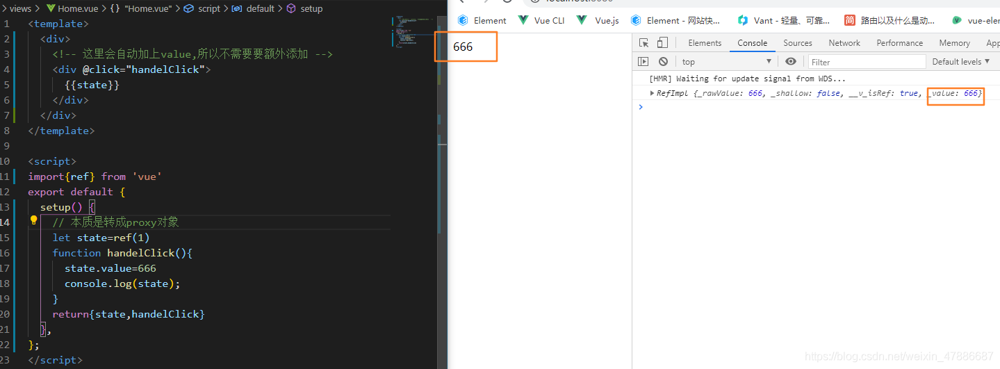

# Vue3

## 一、vue3 和 vue2 的区别

composition API
响应式原理，从 object.defineProperty 变成 proxy

---

## 二、setup 的使用

#### 1.通过 ref 新建响应式数据

##### （1）什么是 ref?

ref 和 reactive 一样,也是用来实现响应式数据的方法
由于 reactive 必须传递一个对象,所以在实际开发中如果只是想让某个变量实现响应式的时候回非常麻烦
所以 Vue3 提供了 ref 方法实现简单值得监听

##### （2）.ref 本质

ref 底层其实还是 reactive,所以当运行时系统会自动根据传入的 ref 转换成 reactive.

##### （3）ref 注意点

在 vue 中使用 ref 的值不用通过 value 获取
在 js 中使用 ref 的值必须通过 value 获取

##### （4）ref 获取元素

在 vue2 中我们可以通过给元素添加 ref=‘xxx’,然后在代码中通过 refs.xxx 的方式来获取元素,在 vue3 中也可以通过 ref 来获取元素.
但不是像以下这种熟悉的方式,因为在 vue3 中没有$和 refs 这些东西.

###### 错误示范

###### 正确写法

---

#### 2.通过 props 接收传递的数据

---

## 三、深入 vue3 响应式原理

