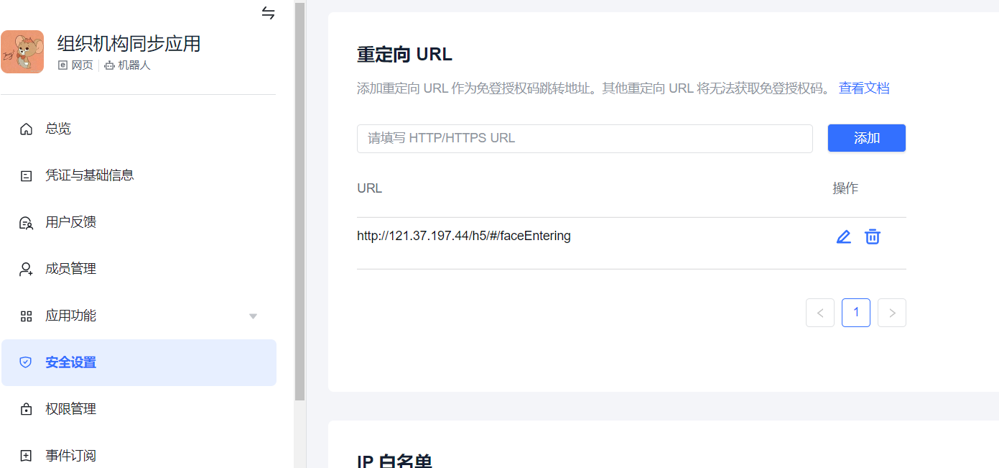

# syoung-platform

### 难点及坑

#### 1.密码自动填充

> 设置autocomplete="off"在chrom中失效

```
问题：在表单的输入框中，有时候我们并不希望点击输入框时，会出现提示信息。这时，在输入框中添加属性:autocomplete="off”，一般能达到目的。而在chrom里面就失效。
失效的原因是：浏览器会根据输入框的input的type属性为password的时候，自动将用户名和密码框填充。

解决方法1：因为浏览器是否自动填充内容，根据type=password来判断的。此时先将作为密码的输入框的type设成text,当点击密码输入框的时候，将其type属性设为password,这样问题就解决了。

解决方法2：可以在不需要默认填写的input框中设置  autocomplete= "new-password"
```

```vue
 <el-input autocomplete="off"
                  v-model="modifyForm.confrimPassword"
                  :maxlength="18"
                  type="text"
                  :placeholder="$t('modifyPassword.placeholder.confirmPassword')"
                  @οnpaste="()=>{return false}"
                  @οncοntextmenu="()=>{return false}"
                  @οncοpy="''"
                  @oncut="''">
        </el-input>
```


#### 2.el-tree默认全选子节点

>  el-tree 半选状态的父节点 ，数据回显，子节点会变成全选 

element  el-tree 默认check-strictly 为false 也就是叶子节点和父节点是关联的状态 
所以返回的数据只要包含父节点 子节点全部选中
如果强制将check-strictly 设置为true 那我们在选在父节点的时候子节点的关联选中效果也就消失了
这种方法 不太好 所以：
逻辑：
1.获取需要返显的节点id
2.遍历 获取对应id的node
3.通过判断node isLeaf是否为子节点 true则设置选中效果

```js
 this.$nextTick(() => {
            this.checkedArr.forEach((i) => {
              //  获取对应id在el-tree上的节点，节点包含很多信息
              const node = this.$refs.tree.getNode(i)
              //判断是否是叶子节点
              if (node.isLeaf) {
                //只勾选叶子节点，当叶子节点勾满时父节点会联动自动选择
                // 接收三个参数(key/data, checked, deep)，1.勾选节点的key或data 2.节点是否选中 3.是否设置子节点，默认为false
                this.$refs.tree.setChecked(node, true)
              }
            })
          })
```


#### 3.crypto-js

```js
 // 加密算法
import CryptoJS from "crypto-js";
 showEncryptAES(str) {
    let key = "q2ck7h95a6vd3l2f";
    let iv = "q2ck7h95a6vd3l2f";
    let mode = "ECB";
    let pad = "Pkcs7";

    let options = {
      key: CryptoJS.enc.Utf8.parse(key),
      iv: CryptoJS.enc.Utf8.parse(iv || key),
      mode: CryptoJS.mode[mode],
      pad: CryptoJS.pad[pad]
    };

    str = CryptoJS.AES.encrypt(str, options.key, {
      iv: options.iv,
      mode: options.mode,
      padding: options.pad
    });

    str = str.toString();
    return str;
  },
```


#### 4.input 上传图片

input [file]标签的accept属性可用于指定上传文件的 MIME类型 。

例如，想要实现默认上传图片文件的代码，代码可如下：

```html
<input type="file" name="file" class="element" accept="image/*">
```

效果如下图所示，默认过滤掉所有非图片文件：

但是这段代码在Chrome和Safari等Webkit浏览器下却出现了响应滞慢的问题，可能要等 6~10s 才能弹出文件选择对话框。简直不能忍呀。

在IE和Firefox中使用 accept=”image/*” 属性则没有发现响应延迟的问题。

于是几经尝试后，发现是 accept=”image/*” 属性的问题，删掉它或者将 * 通配符修改为指定的MIME类型，就可以解决Webkit浏览器下的对话框显示滞慢的问题。

解决办法如下：

```html
<input type="file" accept="image/gif,image/jpeg,image/jpg,image/png,image/svg">
```


accept=”image/*”属性会对每一个文件都遍历一次所有的”image/*”文件类型，当文件较多时，文件的检验时间较长，这可能是Webkit的底层实现的bug。

另外，

accept=”audio/*”和 accept=”video/*” 属性 在 Webkit浏览器下也会有同样的响应延迟的问题。同理，通过将 * 通配符 修改成指定的MIME类型就可解决。

```js
   // 头像上传相关方法
    // 拍照
    showTakePhoto() {
      this.isShowTakePhoto = true
    },
    getTakePhoto(url, file) {
      this.fileToBase64(file).then((base64) => {
        this.$store.commit('CHANGE_LOADING', 1)
        this.base64 = base64
        this.$post(
          '/api/v1/face/detect',
          {
            image: base64,
          },
          this.$apis.faceService,
        )
          .then((res) => {
            this.$store.commit('CHANGE_LOADING', 0)
            if (res.status === 200) {
              this.$set(this.accountDetail, 'pictureUrl', res.data)
              this.$refs.personal_info_form.validateField(['selectProject'])
            } else {
              this.$message({
                message: res.message,
                type: 'warning',
              })
            }
          })
          .catch(() => {
            this.$store.commit('CHANGE_LOADING', 0)
          })
      })
    },
    fileToBase64(file) {
      this.$store.commit('CHANGE_LOADING', 1)
      return new Promise((resolve) => {
        const reader = new FileReader()
        reader.readAsDataURL(file)
        reader.onload = (e) => {
          const result = e.target.result
          this.$store.commit('CHANGE_LOADING', 0)
          resolve(result)
        }
      })
    },
   // 上传图片
    localUpImage() {
      this.$refs.input.value = null
      this.$refs.input.click()
    },
    localChangeUpImage(e) {
      const [file] = e.target.files

      if (file) {
        const formData = new FormData()
        formData.append('file', file)
        this.$post('/minio/upload', formData, this.$apis.orgUrl)
          .then((res) => {
            this.$store.commit('CHANGE_LOADING', 0)
            const { code, state, result } = res
            if (code === 200) {
              this.$set(this.accountDetail, 'pictureUrl', result)
              this.$refs.personal_info_form.validateField(['selectProject'])
            } else {
              this.$message({
                message: res.message,
                type: 'warning',
              })
            }
          })
          .catch(() => {
            this.$store.commit('CHANGE_LOADING', 0)
          })
        this.fileToBase64(file).then((base64) => {
          this.$store.commit('CHANGE_LOADING', 1)
          this.base64 = base64
          this.$post(
            '/api/v1/face/detect',
            {
              image: base64,
            },
            this.$apis.faceService,
          )
            .then((res) => {
              this.$store.commit('CHANGE_LOADING', 0)
              if (res.status === 200) {
                this.$set(this.accountDetail, 'pictureUrl', res.data)
                this.$refs.personal_info_form.validateField(['selectProject'])
              } else {
                this.$message({
                  message: res.message,
                  type: 'warning',
                })
              }
            })
            .catch(() => {
              this.$store.commit('CHANGE_LOADING', 0)
            })
        })
      }
    },
    // 预览+删除
    previewPhoto() {
      this.previewImages = [this.accountDetail.pictureUrl]
      this.photoPreview = true
    },
    deletePhoto() {
      this.accountDetail.pictureUrl = ''
    },
```


#### 5.表单校验

```js
  password: [
          // { required: true, message: "请输入密码", trigger: "blur" },
          {
            validator: (rule, value, callback) => {
              if (!this.accountDetail.id && !value) {
                callback(new Error('请输入密码'))
              } else {
                let reg =
                  /^(?![A-Za-z0-9]+$)(?![a-z0-9\[\]{}\|<>\,\/~;:\-=_!@#$%?^&*()+.]+$)(?![A-Za-z\[\]{}\|<>\,\/~;:\-=_!@#$%?^&*()+.]+$)(?![A-Z0-9\[\]{}\|<>\,\/~;:\-=_!@#$%?^&*()+.]+$)[a-zA-Z0-9\[\]{}\|<>\,\/~;:\-=_!@#$%?^&*()+.]{8,18}$/
                if (reg.test(value)) {
                  callback()
                } else {
                  callback(
                    new Error(
                      '必须为8-18位且同时包含数字、大小写字母、特殊字符四种！',
                    ),
                  )
                }
              }
            },
            trigger: 'blur',
          },
        ],
```

#### 6.页面刷新created不执行

> 页面刷新created不执行

- 当使用路由参数时，多个路由绑定同一个组件，再切换页面时，因为多个路由都渲染同个组件，此时不会销毁再创建组件而是会复用组件，这也就导致路由参数发生变化，但是页面不会刷新的问题

解决办法：
可以通过vue-router 的钩子函数 beforeRouteEnter beforeRouteUpdate beforeRouteLeave 路由进入钩子

```js
beforeRouteEnter(to, from, next) {
// 在组件实例创建前调用
}

beforeRouteUpdate(to, from, next){
// 在当前路由改变，路由参数发生变化，组件被复用时调用
// 里面写获取刷新数据的方法
}
beforeRouteLeave(to, from, next) {
// 当离开当前组件对应的路由时调用
}
```

- 还有可能是因为在路由里设置了 keep-alive


#### 7.el-table 实现单选

https://www.cnblogs.com/badaoliumangqizhi/p/13427666.html

https://blog.csdn.net/weixin_38779534/article/details/103989320


#### 8.飞书鉴权

- [重定向 URL](https://open.feishu.cn/document/uYjL24iN/uYjN3QjL2YzN04iN2cDN?lang=zh-CN)

添加重定向 URL 作为免登授权码跳转地址。其他重定向 URL 将无法获取免登授权码。




- H5鉴权（所有api都需要先鉴权才能使用）[JSSDK官方文档](https://open.feishu.cn/document/uYjL24iN/uITO4IjLykDOy4iM5gjM#2d39479a)

```js
/**
      sha1： 需要自己  npm install js-sha1
      ticket: 
          eg：adaec57dc84bacba6610b9da85b2eaaa649c2074
          1、一般是后端给出接口，直接去取就好
          2、我们自己调用飞书接口，用来调试
      
      **/
      let sha1 = require('js-sha1')
      
      const jianQuan = (ticket) => {
        let nonceStr = 'Y7a8KkqX041bsSwT' // 随机字符串
        let timeStamp = new Date().getTime() // 时间戳
        // 当前网页的 URL（可以为本地局域网网址），不包含 # 及其后面部分
        let url = String(location.href.split('#')[0])
        console.log(location.href.split('#')[0], 99999)
        let verifyStr = `jsapi_ticket=${ticket}&noncestr=${nonceStr}&timestamp=${timeStamp}&url=${url}`
        let signature = sha1(verifyStr)
        console.log('签名', signature)
        window.h5sdk.config({
          appId: 'xxxx', // 必填，应用ID, eg: cli_a066b6f94e39900e
          timestamp: timeStamp, // 必填，生成签名的时间戳，ms级
          nonceStr: nonceStr, // 必填，生成签名的随机串
          signature: signature, // 必填，签名
          jsApiList: [
            'biz.user.getUserInfo',
            'biz.user.employee_id',
            'device.health.getStepCount',
            'biz.user.openDetail',
            'biz.contact.open',
            'device.base.getSystemInfo',
            'biz.util.getClipboardInfo',
            'biz.util.openDocument',
            'biz.util.downloadFile',
            'device.geolocation.get',
            'device.geolocation.start',
            'device.geolocation.stop',
            'biz.user.getUserInfoEx',
            'device.connection.getNetworkType',
          ],
          onSuccess: (res) => {
            console.log(`config: 恭喜你成功啦 ${res} `)
          },
          onFail: (res) => {
            alert(`config: 鉴权失败 ${JSON.stringify(res)}`)
          },
        })
      }

```

例如：获取飞书用户信息

```js
   /** 
      crypto：解密方法，vue项目内一般自带有，如果没有自己去引入一个解密插件
       type： 类型
       prefix：方法名
       extraFunc： 返回
   **/
   
    let crypto = require('crypto')
 
 //  normalCallbacks  公共方法，可以多个api使用一个方法回调
   const normalCallbacks = (type, prefix, extraFunc) => {
          let success = (res) => {
            console.log(`${prefix} success`, res)
            if (extraFunc) extraFunc()
          }
          if (type === 'modal') {
            success = (res) => {
              console.log('获取信息,', res)
              // 这时的敏感信息是加密的
              try {
                const iv = res.iv
                let message = res.encryptedData
                console.log('encryptedData', message)
                console.log('iv', iv)
                console.log('seesionkey', session_key)
                const decrypt_with_aes = () => {
                  message = Buffer.from(message, 'base64')
                  const decipher = crypto.createDecipheriv(
                    'aes-128-cbc',
                    Buffer.from(session_key, 'hex'),
                    Buffer.from(iv, 'hex')
                  )
                  let decrypted = decipher.update(message)
                  decrypted += decipher.final()
                  const data = decrypted.toString()
                  const json = JSON.parse(data)
                  return json
                }
                let openIds = '' // 获取用户信息返回的openId 
                const userInfo = decrypt_with_aes()
                console.log('解析完的数据--》 我拿到用户的openId啦', userInfo)
              } catch (e) {
                console.log(e, 'catch')
              }
            }
          }
          const fail = (err) => {
            console.log(`${prefix} fail`, JSON.stringify(err))
          }
          return { success, fail }
        }
   
   //  开始调用方法， tt方法最好写在ready里边
    window.h5sdk.ready(() => {
       window.tt.getUserInfo({
          withCredentials: true, // 开启用户敏感数据
          ...normalCallbacks('modal', 'getUserInfo'),
       })
    }

```

